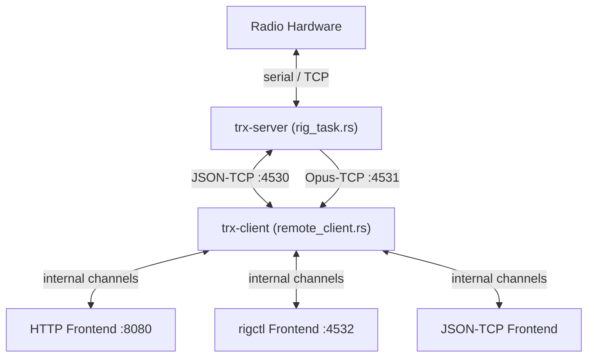

# CLAUDE.md

This file provides guidance to Claude Code (claude.ai/code) when working with code in this repository.

## Commands

```bash
# Build
cargo build --release

# Run tests
cargo test

# Lint
cargo clippy

# Run a single test (by name pattern)
cargo test <test_name>

# Run tests for a specific crate
cargo test -p trx-core

# Generate example config
./target/release/trx-server --print-config > trx-server.toml
./target/release/trx-client --print-config > trx-client.toml

# Run server
./target/release/trx-server --config trx-server.toml
# or via CLI args:
./target/release/trx-server -r ft817 "/dev/ttyUSB0 9600"

# Run client
./target/release/trx-client --config trx-client.toml
```

## Crate Layout

This is a Cargo workspace. All crates live under `src/`:

```
src/
  trx-core/           # Core types, traits, state machine, controller (~3,500 LOC)
  trx-protocol/       # Client↔server protocol DTOs, auth, codec, mapping (~1,100 LOC)
  trx-app/            # Shared application helpers (config paths, logging init)
  trx-reporting/      # PSKReporter UDP uplink + APRS-IS TCP uplink (~1,150 LOC)
  trx-server/         # Server binary: rig_task, audio pipeline, listener (~3,700 LOC)
    trx-backend/      # Backend abstraction trait + factory + dummy
      trx-backend-ft817/    # Yaesu FT-817 binary CAT (BCD encoding)
      trx-backend-ft450d/   # Yaesu FT-450D ASCII CAT
      trx-backend-soapysdr/ # SoapySDR RX with full DSP pipeline (~5,000+ LOC)
  trx-client/         # Client binary: remote connection, frontend spawning (~1,500 LOC)
    trx-frontend/     # Frontend trait (FrontendSpawner), runtime context
      trx-frontend-http/      # Web UI: REST API, SSE, WebSocket audio, session auth
      trx-frontend-http-json/ # JSON-over-TCP control frontend
      trx-frontend-rigctl/    # Hamlib-compatible rigctl TCP interface
  trx-configurator/   # Interactive setup wizard
  decoders/
    trx-aprs/         # APRS packet decoder (AX.25 + APRS-IS)
    trx-cw/           # CW (Morse) decoder (Goertzel tone detection)
    trx-ftx/          # Pure Rust FTx decoder (FT8/FT4/FT2, LDPC/OSD) (~3,000+ LOC)
    trx-wspr/         # WSPR weak-signal decoder
    trx-ais/          # AIS maritime transponder decoder
    trx-rds/          # RDS decoder for WFM (~2,000 LOC)
    trx-vdes/         # VDES maritime data exchange decoder (~1,300 LOC)
    trx-decode-log/   # JSON Lines file logging with date rotation
```

## Architecture

The project is split into a **server** (connects to the radio hardware) and a **client** (exposes user-facing frontends). They communicate over a JSON TCP connection (default port 4530). Audio streams over a separate TCP connection (default port 4531) using Opus encoding.

### Data flow



### trx-core controller

The rig controller (`src/trx-core/src/rig/controller/`) is the central state management component:

- **`machine.rs`** — `RigMachineState` enum with states: `Disconnected`, `Connecting`, `Initializing`, `PoweredOff`, `Ready`, `Transmitting`, `Error`
- **`handlers.rs`** — `RigCommandHandler` trait; commands: `SetFreq`, `SetMode`, `SetPtt`, `PowerOn/Off`, `ToggleVfo`, `Lock/Unlock`, `GetSnapshot`, etc.
- **`events.rs`** — `RigListener` trait and `RigEventEmitter` for broadcasting frequency/mode/PTT/state/meter/lock/power changes
- **`policies.rs`** — `RetryPolicy` (`ExponentialBackoff`, `FixedDelay`, `NoRetry`) and `PollingPolicy` (`AdaptivePolling`, `FixedPolling`, `NoPolling`)

### Decoders

Signal decoders run as background tasks in `trx-server`, consuming decoded audio. `trx-ftx` provides the FT8/FT4/FT2 decoder in pure Rust. Decoded frames can be forwarded to PSKReporter and APRS-IS (IGate) uplinks, or logged via `trx-decode-log`.

## Diagrams

Always use [Mermaid](https://mermaid.js.org/) for diagrams in Markdown files. Never use ASCII art, box-drawing characters, or plain-text diagrams. GitHub renders Mermaid natively in ```mermaid fenced code blocks.

## Commit Format

```
[<type>](<crate>): <description>
```

Types: `feat`, `fix`, `docs`, `style`, `refactor`, `test`, `chore`. Use `(trx-rs)` for repo-wide changes. Sign commits with `git commit -s`. Write isolated commits per crate.

## Codebase Review Observations

Full architecture documentation: `docs/Architecture.md`
Improvement plan: `docs/Improvement-Areas.md`

*Last reviewed: 2026-03-29*

### Strengths

- **Explicit state machine**: `RigMachineState` FSM (7 states) prevents invalid states with a deterministic transition table and exhaustive matching. Well-tested with lifecycle, error recovery, and invalid transition tests. `ReadyStateData`/`TransmittingStateData` use `pub(crate)` fields with controlled accessors.
- **Trait-based polymorphism**: Clean abstraction boundaries (`RigCat`, `RigSdr`, `AudioSource`, `RigListener`, `RigCommandHandler`, `CommandExecutor`, `TokenValidator`, `FrontendSpawner`) enable loose coupling and testability. `RigCat`/`RigSdr` split cleanly separates CAT ops from SDR-specific methods.
- **Multi-rig architecture**: Per-rig task isolation with `HashMap<rig_id, RigHandle>` routing, per-rig state/spectrum/audio/decoder-history channels, dual-connection model (main + spectrum) in the client, and backward-compatible single-rig mode.
- **Async concurrency model**: Proper use of tokio channels -- `watch` for state snapshots, `broadcast` for PCM/decode fan-out, `mpsc` for commands. No mutex contention on hot paths. Spectrum deduplication collapses concurrent GetSpectrum requests.
- **Comprehensive SDR support**: Full DSP pipeline with multi-mode demodulation (SSB, AM, SAM, FM, WFM, AIS, VDES), virtual channel management, squelch, noise blanker, spectrum FFT, RDS decoding. AVX2-optimized FM discriminator with scalar fallbacks.
- **Pure Rust decoders**: FT8/FT4/FT2, APRS, CW, WSPR, AIS, VDES, RDS -- all implemented without C FFI dependencies. Consistent decoder pattern: stateful struct → `process_block()` → `decode_if_ready()`.
- **Good test coverage** in protocol layer: codec, mapping, auth all have thorough unit tests with round-trip verification. 45+ mapping tests cover all command variants.
- **Feature-gated backends**: ft817, ft450d, soapysdr compiled conditionally to minimize binary size. Factory pattern with name normalization for registration.
- **Defensive error handling**: Lock poisoning recovery, stream error deduplication with 60s summaries, input truncation in logs (128 chars), per-IP rate limiting on auth endpoints.
- **Well-documented DSP guidelines**: `docs/Optimization-Guidelines.md` captures lessons on NCO design, polyphase resampling, AVX2 batching, and stereo FM decoding.

### Areas for Improvement

All P0–P3 items resolved or dropped. See `docs/Improvement-Areas.md` for details.
