# Fix Plan

Current state analysis of trx-rs as of 2026-04-08.

## Overall Assessment

The codebase is in good shape. Clippy is clean, no `unsafe` code, no TODO/FIXME markers,
robust error handling throughout. One broken test and several untested crates are the
main weak spots.

---

## P0 — Broken Test

### 1. `test_toggle_ft8_decode` returns 500 instead of 200

**Location:** `src/trx-client/trx-frontend/trx-frontend-http/src/api/mod.rs:1016`

**Root cause:** The handler `toggle_ft8_decode` (decoder.rs:353) requires
`context: web::Data<Arc<FrontendRuntimeContext>>` for multi-rig state resolution.
The test registers `state_rx` and `rig_tx` but not `context`, so actix-web returns 500
(missing app data). A `make_context()` helper already exists at line 757 but is unused
by this test.

**Fix:** Add `.app_data(web::Data::new(make_context()))` to the test's `App` builder
(line 1036-1041). ~1 line change.

**Impact:** This is the only failing test in the entire suite (50 pass, 1 fail).

---

## P1 — Test Coverage Gaps

### 2. trx-aprs decoder — 0 tests (596 LOC)

**Location:** `src/decoders/trx-aprs/src/lib.rs`

Bell 202 AFSK demodulator + AX.25 HDLC frame parser + CRC-16 validation.
No `#[cfg(test)]` module at all.

**Suggested tests:**
- CRC-16 computation on known frames
- HDLC flag detection and bit-unstuffing
- Full frame decode from synthetic AFSK audio (1200 baud sine pairs)
- Rejection of corrupted frames (bad CRC, truncated)

### 3. trx-decode-log — 0 tests (226 LOC)

**Location:** `src/decoders/trx-decode-log/src/lib.rs`

JSON Lines file writer with date-based rotation. Pure I/O wrapper.

**Suggested tests:**
- Write + read-back round-trip in a tempdir
- Date rotation triggers new file creation
- Flush error logging (mock writer)

### 4. trx-reporting — partial tests (1,065 LOC across 2 files)

**Location:** `src/trx-reporting/src/pskreporter.rs` (582 LOC),
`src/trx-reporting/src/aprsfi.rs` (483 LOC)

Both files have `#[cfg(test)]` modules but coverage is limited to serialization.
Network behavior (reconnect, rate-limit, batching) is untested.

**Suggested tests:**
- PSKReporter UDP datagram encoding round-trip
- APRS-IS login line formatting
- Spot batching and dedup logic (unit-testable without network)

---

## P2 — Code Quality

### 5. `audio.rs` is 4,000 LOC

**Location:** `src/trx-server/src/audio.rs`

Houses all decoder task launchers (FT8, FT4, FT2, APRS, AIS, VDES, CW, WSPR, LRPT,
WEFAX). Each launcher follows the same pattern. The file is coherent but large.

**Suggested improvement:** Extract decoder launchers into a `decoders/` submodule
within trx-server, one file per decoder family (e.g., `ftx.rs`, `aprs.rs`, `wefax.rs`).
Keep the audio pipeline and capture logic in `audio.rs`.

### 6. `scheduler.rs` is 1,585 LOC

**Location:** `src/trx-client/trx-frontend/trx-frontend-http/src/scheduler.rs`

Mixes grayline computation, timespan matching, satellite pass prediction, and the
scheduler state machine. Well-tested but dense.

**Suggested improvement:** Extract grayline and satellite pass logic into separate
modules (these are pure functions with no HTTP dependencies).

---

## P3 — Minor

### 7. `#[allow(dead_code)]` in soapysdr backend (4 annotations)

**Locations:**
- `vchan_impl.rs:66,87` — `fixed_slot_count`, `process_pair`
- `real_iq_source.rs:20` — `device`
- `demod.rs:113` — lifetime anchor

All documented as intentional (lifetime anchors / reserved capacity). No action needed
unless the fields can be converted to `PhantomData` or `_`-prefixed without breaking
semantics.

### 8. FrontendRuntimeContext test helper duplication risk

**Location:** `src/trx-client/trx-frontend/trx-frontend-http/src/api/mod.rs:757`

`make_context()` and `spawn_rig_responder()` are good helpers but only used by some
tests. As new endpoint tests are added, ensure they consistently use these helpers to
avoid repeating the `test_toggle_ft8_decode` bug.

---

## Implementation Order

```mermaid
gantt
    title Fix Plan
    dateFormat X
    axisFormat %s

    section P0
    Fix test_toggle_ft8_decode          :p0, 0, 1

    section P1
    Add trx-aprs tests                 :p1a, 1, 3
    Add trx-decode-log tests            :p1b, 1, 2
    Expand trx-reporting tests          :p1c, 1, 3

    section P2
    Split audio.rs decoder launchers    :p2a, 3, 5
    Extract scheduler pure functions    :p2b, 3, 5
```

P0 is a one-line fix. P1 items are independent and can be parallelized. P2 items are
refactors that should wait until P1 tests provide regression safety.
