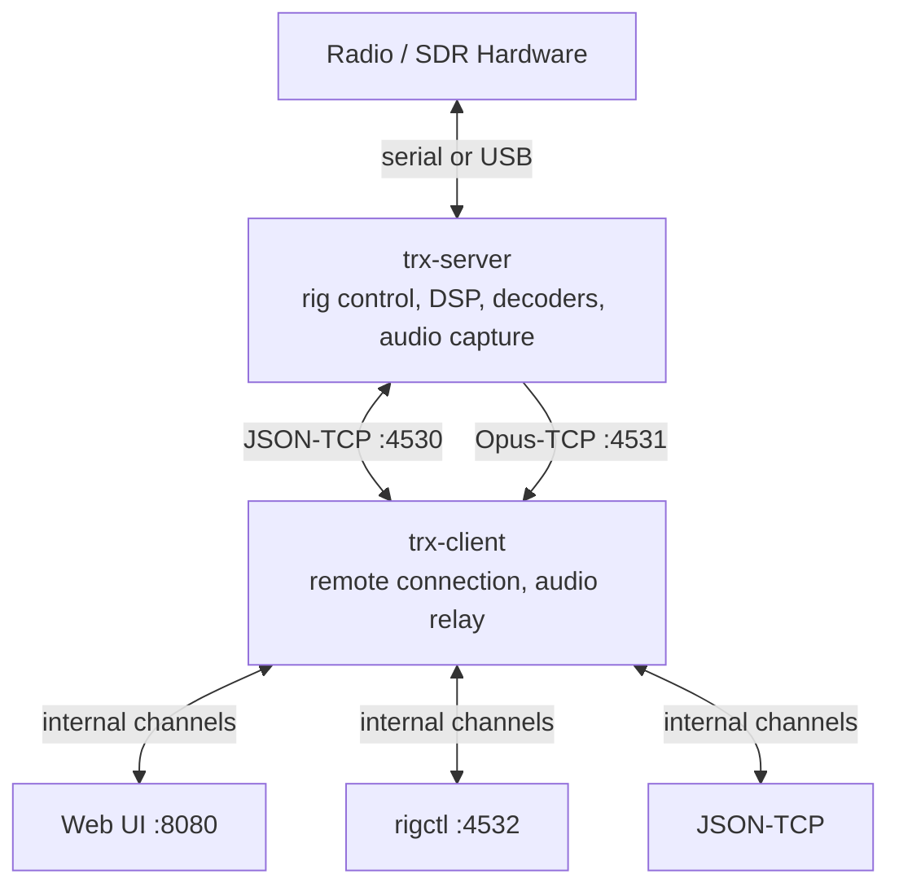

<div align="center">
  

# trx-rs

A modular amateur radio control stack written in Rust.

[](LICENSES)

</div>

`trx-rs` splits radio hardware access from user-facing interfaces so you can run
rig control, SDR DSP, decoding, audio streaming, and web access as separate,
composable pieces.

| | |
|---|---|
| **Backends** | Yaesu FT-817, Yaesu FT-450D, SoapySDR |
| **Frontends** | Web UI, rigctl-compatible TCP, JSON-over-TCP |
| **Decoders** | AIS, APRS, CW, FT8, RDS, VDES, WSPR |
| **Audio** | Opus streaming between server, client, and browser |

## Quick Start

### 1. Install dependencies

<details>
<summary><b>Debian / Ubuntu</b></summary>

```bash
sudo apt install build-essential pkg-config cmake libopus-dev libasound2-dev
# Optional — SDR support
sudo apt install libsoapysdr-dev
```
</details>

<details>
<summary><b>Fedora</b></summary>

```bash
sudo dnf install gcc pkg-config cmake opus-devel alsa-lib-devel
# Optional — SDR support
sudo dnf install SoapySDR-devel
```
</details>

<details>
<summary><b>Arch Linux</b></summary>

```bash
sudo pacman -S base-devel pkgconf cmake opus alsa-lib
# Optional — SDR support
sudo pacman -S soapysdr
```
</details>

<details>
<summary><b>macOS (Homebrew)</b></summary>

```bash
brew install cmake opus
# Optional — SDR support
brew install soapysdr
```
</details>

See [Build Requirements](https://github.com/sgrams/trx-rs/wiki/User-Manual#build-requirements)
in the wiki for details on each library.

### 2. Build and run

```bash
cargo build --release
cp trx-rs.toml.example trx-rs.toml   # edit for your environment
cargo run -p trx-server
cargo run -p trx-client
```

Open the configured HTTP frontend address in a browser (default `http://localhost:8080`).

Build without SDR support: `cargo build --release --no-default-features`

## How It Works



`trx-server` owns hardware access and runs the DSP pipeline.
`trx-client` connects over TCP and exposes user-facing frontends.
This keeps hardware local to one host while making control available over the network.

## Documentation

| Resource | Description |
|----------|-------------|
| [User Manual](https://github.com/sgrams/trx-rs/wiki/User-Manual) | Configuration, features, and usage |
| [Architecture](https://github.com/sgrams/trx-rs/wiki/Architecture) | System design, crate layout, data flow, and internals |
| [Optimization Guidelines](https://github.com/sgrams/trx-rs/wiki/Optimization-Guidelines) | Performance guidelines for the real-time DSP pipeline |
| [Planned Features](https://github.com/sgrams/trx-rs/wiki/Planned-Features) | Roadmap and design notes |
| [Contributing](CONTRIBUTING.md) | Commit conventions, workflow, and code style |

## License

BSD-2-Clause. See [`LICENSES`](LICENSES) for bundled third-party license files.
