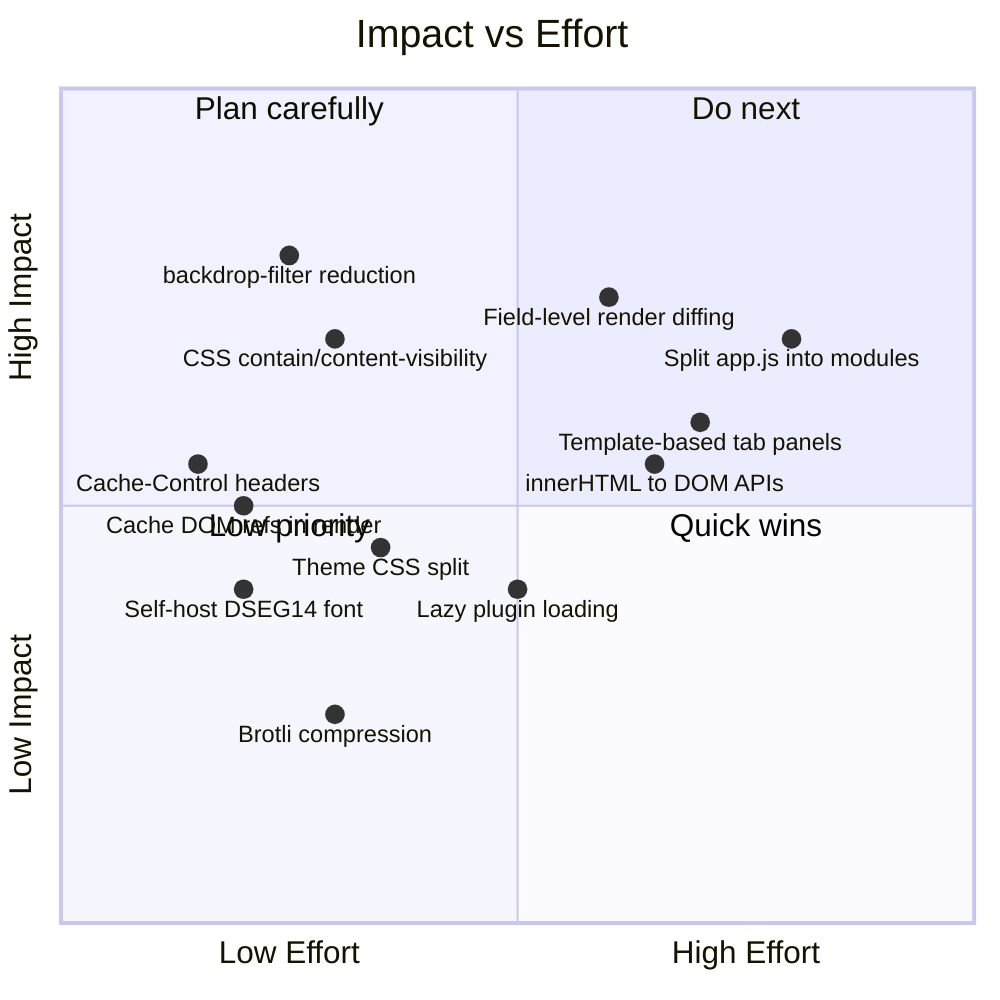

# Frontend Styling & Performance Improvements

*Analysis date: 2026-04-01*

This document captures observations and improvement recommendations for the
trx-rs web frontend (`trx-frontend-http`). The frontend is a single-page
application served as embedded static assets (gzip-compressed with ETag
caching) from the Actix-Web server.

## Current asset inventory

| File | Lines | Size |
|------|------:|-----:|
| `style.css` | 5,318 | 144 KB |
| `app.js` | 11,928 | 428 KB |
| `index.html` | 1,564 | 96 KB |
| `webgl-renderer.js` | 526 | 20 KB |
| `decode-history-worker.js` | 176 | 8 KB |
| `leaflet-ais-tracksymbol.js` | 120 | 8 KB |
| 15 plugin scripts | 7,360 | 304 KB |
| **Total** | **~27,000** | **~1 MB** |

All assets are pre-compressed with `flate2` (gzip, `Compression::best()`) and
served with `ETag` + `If-None-Match` support for conditional requests. The
Actix `Compress` middleware handles dynamic responses.

---

## 1. CSS observations

### 1.1 Monolithic stylesheet (P1)

`style.css` is a single 5,318-line file covering every tab, theme, responsive
breakpoint, map overlay, decoder UI, scheduler, recorder, and settings panel.
Browsers must parse the entire stylesheet before first paint even though most
users only interact with 1-2 tabs at a time.

**Recommendations:**
- Split into logical partitions: `base.css` (variables, reset, layout), `tabs/*.css` (per-tab styles), `themes/*.css`. The server can concatenate and compress at build time.
- At minimum, move the theme colour blocks (lines 3770-5318, ~1,550 lines / 29% of the file) into a separate `themes.css` loaded asynchronously after initial paint, since the default theme is already in `:root`.
- Consider using `@layer` (CSS Cascade Layers) to manage specificity between base, component, and theme styles, eliminating the need for `!important` (currently 21 occurrences).

### 1.2 `backdrop-filter` overuse (P1)

There are 26 `backdrop-filter` declarations (13 pairs with `-webkit-` prefix).
`backdrop-filter: blur()` is one of the most expensive CSS properties -- it
forces the browser to composite, rasterize, and blur everything behind the
element on every frame.

Affected areas: tab bar, controls tray, frequency overlay, modals, connection
banner, bottom nav, neon-disco theme overlay.

**Recommendations:**
- Remove `backdrop-filter` from elements that are always opaque or rarely overlap dynamic content (e.g. bottom tab bar over static background).
- For the spectrum/waterfall overlay controls, use a solid semi-transparent `background` instead of blur -- the visual difference is negligible on a dark spectrogram.
- Where blur is desired (modals), use `will-change: backdrop-filter` and keep blur radius low (4-6px instead of 12-18px). Larger radii are proportionally more expensive.
- Gate expensive blur behind a `@media (prefers-reduced-motion: no-preference)` query or a `[data-effects="full"]` attribute so low-end devices can opt out.

### 1.3 `color-mix()` usage (P2)

184 occurrences of `color-mix(in srgb, ...)` throughout the stylesheet. While
`color-mix` is well-supported in modern browsers, each call is resolved at
computed-value time. Repeated identical mixes (e.g. button hover states
repeated across themes) add unnecessary style recalculation cost.

**Recommendations:**
- Pre-compute frequently used mixes as CSS custom properties in the theme blocks (e.g. `--btn-hover-bg`, `--btn-active-bg`).
- This reduces computed-value work and also makes the palette more explicit and maintainable.

### 1.4 Theme system duplication (P2)

Each of the 10 colour themes repeats ~28 variable declarations for both dark
and light mode (560 variable declarations total). The theme blocks span lines
3770-5318 (29% of the entire stylesheet).

**Recommendations:**
- Move themes to a separate file loaded after first paint (the default `:root` theme is always available).
- Consider generating theme CSS from a data source (JSON/TOML) at build time to reduce manual duplication.
- Use `color-scheme` and `light-dark()` (CSS Color Level 5) to collapse the dark/light pairs where values differ only in lightness.

### 1.5 Transitions on non-essential properties (P3)

25 `transition` declarations, several targeting `background`, `border-color`,
and `box-shadow` simultaneously. Multi-property transitions on buttons and
inputs cause style recalculation on hover/focus for every such element.

**Recommendations:**
- Prefer transitioning only `opacity` and `transform` (GPU-composited).
- For colour changes, use `transition: background-color 100ms` rather than the shorthand `background` which also transitions `background-image` and other sub-properties.
- Add `will-change: transform` only to elements that are actively animating (currently only 2 occurrences, which is good).

### 1.6 Missing `contain` declarations (P2)

Tab content panels, decode history tables, map containers, and spectrum
canvases do not use CSS `contain` or `content-visibility`. When a large decode
history table updates, the browser recalculates layout for the entire page.

**Recommendations:**
- Add `contain: content` to inactive tab panels (`[data-tab]:not(.active)`).
- Add `content-visibility: auto` with `contain-intrinsic-size` to off-screen panels (decode history, map, statistics). This lets the browser skip rendering for hidden content entirely.
- Add `contain: strict` to the spectrum/waterfall canvas containers since their size is fixed and they don't affect sibling layout.

---

## 2. JavaScript observations

### 2.1 Monolithic `app.js` (P1)

The main application script is 11,928 lines (428 KB uncompressed). It is loaded
synchronously in the HTML `<head>` (via embedded asset), blocking first paint
until fully parsed and executed. The 15 plugin scripts add another 7,360 lines.

**Recommendations:**
- Mark the script tag `defer` or move it to end of `<body>` so HTML parsing completes before script execution.
- Split `app.js` into logical modules: `core.js` (SSE, auth, render loop), `spectrum.js`, `map.js`, `decoder.js`, `recorder.js`, `settings.js`. Load non-critical modules lazily when the user navigates to the corresponding tab.
- Use ES modules (`type="module"`) for clean dependency management and tree-shaking potential.

### 2.2 DOM query overhead (P2)

The codebase contains ~359 `querySelector`/`getElementById` calls, many of
which execute on every SSE event (inside `render()`). DOM lookups are not free,
especially `querySelector` with compound selectors.

**Recommendations:**
- Cache DOM references at initialization time (many already are, but the render path still re-queries elements like `document.getElementById("tab-main")`).
- Move repeated lookups (e.g. line 3575 `document.getElementById("tab-main")` inside `es.onmessage`) to module-level constants.

### 2.3 `innerHTML` usage (P2)

33 `innerHTML` assignments in `app.js` and 72 across plugin scripts. Each
`innerHTML` write forces the browser to:
1. Serialize the old DOM subtree for GC
2. Parse the HTML string
3. Build and insert a new DOM subtree

This is both a performance concern (layout thrashing) and a security concern
(XSS if any user-controlled data is interpolated without escaping).

**Recommendations:**
- Replace `innerHTML` with DOM APIs (`createElement`/`appendChild`) or `DocumentFragment` for bulk updates (only 4 `createDocumentFragment` uses currently).
- For large lists (decode history, bookmarks, recorder file lists), use a virtualised list pattern that only renders visible rows.
- Where `innerHTML` is used to clear a container, prefer `replaceChildren()` (clears children without HTML parsing).

### 2.4 SSE render path efficiency (P2)

Every SSE state event triggers `render(update)` which is a ~300-line function
touching dozens of DOM elements. The function does not diff -- it
unconditionally sets properties even when values have not changed.

The string-equality guard (`if (evt.data === lastRendered) return`) is a good
optimisation for identical payloads, but when any field changes (e.g. S-meter
value), the entire render function runs.

**Recommendations:**
- Implement field-level diffing: compare individual fields against previous values and only update DOM elements whose backing data changed.
- Group updates by tab: if the user is on the "Map" tab, skip render work for "Main" tab elements (meters, frequency display, controls).
- Use `scheduleUiFrameJob()` (already exists at line 3685) more aggressively to batch DOM writes into animation frames.

### 2.5 Spectrum/waterfall rendering (P2)

The WebGL renderer (`webgl-renderer.js`) is well-implemented with proper
shader programs and batched draws. However:
- The CSS colour parsing (`parseCssColor`) uses a DOM probe element (appended to
  body) and `getComputedStyle` as a fallback, which triggers layout.
- The colour cache is a simple `Map` with no eviction policy.

**Recommendations:**
- Parse theme colours once when the theme changes, not on every frame.
- Invalidate the `cssColorCache` on theme switch events.

### 2.6 Plugin script loading (P3)

All 15 plugin scripts are loaded eagerly in `index.html` regardless of which
decoders are active. Plugins like `ais.js`, `vdes.js`, `sat.js`,
`sat-scheduler.js`, and `hf-aprs.js` are only relevant for specific use cases.

**Recommendations:**
- Load plugin scripts on demand when the corresponding decoder or feature is activated.
- Use dynamic `import()` if migrated to ES modules, or lazy `<script>` injection.

### 2.7 Web Worker utilisation (P3)

Only one Web Worker exists (`decode-history-worker.js`, 176 lines) for CBOR
decode-history parsing. All other heavy work (SSE parsing, DOM updates, spectrum
rendering, map marker management) runs on the main thread.

**Recommendations:**
- Move SSE JSON parsing to a shared worker so the main thread only receives pre-parsed objects.
- Offload spectrum FFT data processing / colour mapping to a worker, posting the resulting `ImageData` to the main thread for canvas rendering.

---

## 3. HTML observations

### 3.1 CDN dependencies (P2)

The page loads two external resources at startup:
- `@fontsource/dseg14-classic/400.css` from `cdn.jsdelivr.net`
- `leaflet@1.9.4/dist/leaflet.css` from `unpkg.com`

Both use `rel="preload" as="style"` with an `onload` trick to make them
non-blocking, which is good. However:
- If CDN is unreachable (offline/firewalled deployments common in ham radio),
  the font never loads and the frequency display falls back to the system font.
- Leaflet is always loaded even if the user never opens the Map tab.

**Recommendations:**
- Self-host the DSEG14 font as an embedded asset (it is small, ~30 KB woff2). This eliminates the CDN dependency entirely and ensures the frequency display always renders correctly.
- Defer Leaflet CSS loading until the Map tab is first opened.

### 3.2 Inline SVG icons (P3)

Tab bar icons are inline SVGs in the HTML (lines 35-63). Each icon is ~150-250
bytes of markup. This is acceptable for a small number of icons and avoids
extra HTTP requests, but the tab bar HTML is dense and hard to maintain.

**Recommendation:**
- Consider an SVG sprite sheet or moving icons to a small icon font to improve readability without extra requests.

### 3.3 HTML size (P2)

`index.html` is 1,564 lines (96 KB uncompressed). All tab content panels are
present in the initial HTML regardless of which tab is active.

**Recommendations:**
- Use `<template>` elements for tab panels that are not initially visible. Clone and insert them when the tab is first activated. This reduces initial DOM node count and speeds up first paint.
- The server already does template substitution (`{ver}` placeholders). Extend this to strip unused tab content for deployments that don't use certain features.

---

## 4. Responsive design observations

### 4.1 Breakpoints (P3)

Six responsive breakpoints are defined:
- `>1100px`: side bookmark panels
- `<1099px`: hide side bookmarks
- `<900px`: full-width card
- `<760px`: mobile layout (touch targets, stacked controls)
- `<640px`: bottom tab bar, mobile nav
- `<520px`: compact mobile
- `(hover: none) and (pointer: coarse)`: touch-specific

This is a well-structured responsive system. Minor improvements:
- Use `min-width` mobile-first instead of `max-width` desktop-first to reduce CSS specificity conflicts.
- Consider `container queries` for components like the controls tray and decode history table, so they respond to their container size rather than the viewport.

### 4.2 Touch target sizing (P3)

Mobile buttons get `min-height: 2.8rem` at `<760px`. The
`(hover: none) and (pointer: coarse)` media query adds additional touch
accommodations. This meets the 44px minimum recommended by WCAG.

---

## 5. Accessibility observations

### 5.1 `aria-live` regions (P1)

The connection-lost banner and power hint text update dynamically but were
flagged in the Settings-Menu-UX-Analysis as missing `aria-live` on toast
notifications. Ensuring all dynamic status text has `aria-live="polite"` or
`aria-live="assertive"` (for errors) is critical for screen reader users.

### 5.2 Keyboard navigation (P2)

The tab bar uses `<button>` elements (good, natively focusable). However, the
spectrum canvas, jog wheel, and map are mouse/touch-only without keyboard
equivalents. The Settings-Menu-UX-Analysis noted the timeline SVG is not
keyboard-operable.

### 5.3 Colour contrast (P2)

`--text-muted` values (`#91a3bd` on `#0f172a` for dark, `#4a5568` on `#ffffff`
for light) should be verified against WCAG AA (4.5:1 for normal text). The
dark theme muted text calculates to approximately 4.8:1 (passes), but some
theme variants (e.g. Neon Disco) may not meet contrast requirements.

---

## 6. Server-side delivery observations

### 6.1 Asset compression (already good)

Static assets are pre-compressed with `gzip` at `Compression::best()` level
and served with ETag headers. Conditional `304 Not Modified` responses avoid
re-transferring unchanged assets.

### 6.2 Missing `Cache-Control` headers (P2)

While ETags are present, the analysis did not find explicit `Cache-Control`
headers on static assets. Adding `Cache-Control: public, max-age=31536000,
immutable` for versioned assets (with cache-busting query strings) would
eliminate conditional requests entirely for repeat visits.

### 6.3 Consider Brotli compression (P3)

Brotli (`br`) typically achieves 15-25% better compression than gzip for text
assets. For a 428 KB `app.js`, this could save ~60-100 KB of transfer. Actix
supports Brotli via the `Compress` middleware.

---

## 7. Priority summary

### Quick wins (low effort, high impact)
1. Reduce `backdrop-filter` usage (13 blur instances) -- immediate paint perf gain
2. Add `contain: content` / `content-visibility: auto` to inactive tabs
3. Add `Cache-Control` headers to static assets
4. Cache remaining DOM references in the render path

### Next phase (moderate effort)
5. Split theme CSS into a separate lazy-loaded file
6. Self-host DSEG14 font
7. Pre-compute `color-mix` results as CSS variables
8. Field-level diffing in the SSE render function
9. Replace `innerHTML` with DOM APIs in hot paths

### Longer-term
10. Split `app.js` into ES modules with lazy loading
11. Lazy-load plugin scripts and Leaflet on demand
12. Use `<template>` elements for deferred tab content
13. Migrate to Brotli compression
14. Move SSE parsing and spectrum processing to Web Workers
