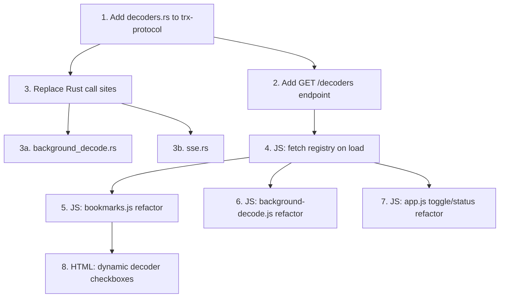

# Decoder Registry Consolidation Plan

**Status:** Proposed
**Target crate:** `trx-protocol`

## Problem

The set of supported decoders and their mode/activation semantics is defined
independently in 4+ locations with no single source of truth.  Adding a new
decoder requires touching every copy; the copies are already out of sync.

### Duplicate definitions today

| Location | What it defines | Drift |
|----------|----------------|-------|
| `background_decode.rs` `SUPPORTED_DECODER_KINDS` | `["aprs","ais","ft8","ft4","ft2","wspr","hf-aprs"]` | Missing `lrpt` |
| `background_decode.rs` `bookmark_supported_decoder_kinds()` | Mode fallback: `AIS→ais`, `PKT→aprs` | — |
| `sse.rs` `bookmark_decoder_kinds()` | Same mode fallback, duplicated | — |
| `background-decode.js` `SUPPORTED_DECODERS` | `["aprs","ais","ft8","wspr","hf-aprs"]` | Missing `ft4`, `ft2`, `lrpt` |
| `background-decode.js` `bookmarkDecoderKinds()` | Mode fallback: `AIS→ais`, `PKT→aprs` | — |
| `bookmarks.js` `bmReadDecoders()` / `bmWriteDecoders()` | 8 hardcoded checkbox IDs | — |
| `app.js` `_decoderToggles` | 6 hardcoded toggle button entries | — |
| `app.js` `setModeBoundDecodeStatus()` calls | Hardcoded mode→decoder pairs | — |
| `app.js` `bmApply()` | Gates decoder toggles on `mode === "DIG" \|\| mode === "FM"` | — |

### Implicit categories

Two activation patterns exist but are never formalised:

- **Mode-bound** — always active when the rig is in the matching mode (AIS,
  APRS/PKT, CW, VDES, RDS).  No user toggle.
- **Toggle-gated** — user explicitly enables/disables; only meaningful in
  certain modes (FT8, FT4, FT2, WSPR, HF-APRS, LRPT).

---

## Design

### 1. Decoder registry in `trx-protocol`

Add `src/trx-protocol/src/decoders.rs`:

```rust
use serde::{Deserialize, Serialize};

#[derive(Debug, Clone, Copy, PartialEq, Eq, Serialize, Deserialize)]
#[serde(rename_all = "snake_case")]
pub enum DecoderActivation {
    /// Automatically active when the rig mode matches.
    ModeBound,
    /// User-controlled toggle; only runs in `active_modes`.
    Toggle,
}

#[derive(Debug, Clone, Serialize, Deserialize)]
pub struct DecoderDescriptor {
    /// Machine identifier, e.g. `"ft8"`, `"aprs"`.
    pub id: &'static str,
    /// Human-readable label, e.g. `"FT8"`, `"APRS"`.
    pub label: &'static str,
    /// How the decoder is activated.
    pub activation: DecoderActivation,
    /// Rig modes where this decoder operates (upper-case).
    pub active_modes: &'static [&'static str],
    /// Whether the decoder can run on SDR virtual channels
    /// (background-decode / scheduler).
    pub background_decode: bool,
    /// Whether this decoder should appear in bookmark forms.
    pub bookmark_selectable: bool,
}

pub const DECODER_REGISTRY: &[DecoderDescriptor] = &[
    DecoderDescriptor {
        id: "ais",
        label: "AIS",
        activation: DecoderActivation::ModeBound,
        active_modes: &["AIS"],
        background_decode: true,
        bookmark_selectable: true,
    },
    DecoderDescriptor {
        id: "aprs",
        label: "APRS",
        activation: DecoderActivation::ModeBound,
        active_modes: &["PKT"],
        background_decode: true,
        bookmark_selectable: true,
    },
    DecoderDescriptor {
        id: "vdes",
        label: "VDES",
        activation: DecoderActivation::ModeBound,
        active_modes: &["VDES"],
        background_decode: false,
        bookmark_selectable: false,
    },
    DecoderDescriptor {
        id: "cw",
        label: "CW",
        activation: DecoderActivation::ModeBound,
        active_modes: &["CW", "CWR"],
        background_decode: false,
        bookmark_selectable: false,
    },
    DecoderDescriptor {
        id: "ft8",
        label: "FT8",
        activation: DecoderActivation::Toggle,
        active_modes: &["DIG", "USB"],
        background_decode: true,
        bookmark_selectable: true,
    },
    DecoderDescriptor {
        id: "ft4",
        label: "FT4",
        activation: DecoderActivation::Toggle,
        active_modes: &["DIG", "USB"],
        background_decode: true,
        bookmark_selectable: true,
    },
    DecoderDescriptor {
        id: "ft2",
        label: "FT2",
        activation: DecoderActivation::Toggle,
        active_modes: &["DIG", "USB"],
        background_decode: true,
        bookmark_selectable: true,
    },
    DecoderDescriptor {
        id: "wspr",
        label: "WSPR",
        activation: DecoderActivation::Toggle,
        active_modes: &["DIG", "USB"],
        background_decode: true,
        bookmark_selectable: true,
    },
    DecoderDescriptor {
        id: "hf-aprs",
        label: "HF APRS",
        activation: DecoderActivation::Toggle,
        active_modes: &["DIG", "USB"],
        background_decode: true,
        bookmark_selectable: true,
    },
    DecoderDescriptor {
        id: "lrpt",
        label: "Meteor LRPT",
        activation: DecoderActivation::Toggle,
        active_modes: &["DIG", "USB"],
        background_decode: false,
        bookmark_selectable: true,
    },
];
```

Re-export from `trx-protocol/src/lib.rs`:

```rust
pub mod decoders;
pub use decoders::{DecoderActivation, DecoderDescriptor, DECODER_REGISTRY};
```

### 2. Shared resolver functions in `trx-protocol::decoders`

Replace all duplicated bookmark→decoder resolution with shared helpers:

```rust
/// Return decoder IDs supported for background-decode / virtual channels.
pub fn background_decoder_ids() -> impl Iterator<Item = &'static str> {
    DECODER_REGISTRY.iter()
        .filter(|d| d.background_decode)
        .map(|d| d.id)
}

/// Resolve a bookmark's effective decoder kinds.
///
/// If the bookmark has explicit `decoders`, filter to supported IDs.
/// Otherwise, infer from mode using mode-bound entries in the registry.
pub fn resolve_bookmark_decoders(
    explicit_decoders: &[String],
    mode: &str,
    background_only: bool,
) -> Vec<String> {
    let supported: Vec<&DecoderDescriptor> = DECODER_REGISTRY.iter()
        .filter(|d| !background_only || d.background_decode)
        .collect();

    // Explicit decoders take priority.
    let from_explicit: Vec<String> = explicit_decoders.iter()
        .map(|s| s.trim().to_ascii_lowercase())
        .filter(|s| supported.iter().any(|d| d.id == s.as_str()))
        .collect();
    if !from_explicit.is_empty() {
        return dedup(from_explicit);
    }

    // Fall back: infer from mode via mode-bound decoders.
    let mode_upper = mode.trim().to_ascii_uppercase();
    supported.iter()
        .filter(|d| d.activation == DecoderActivation::ModeBound
                  && d.active_modes.contains(&mode_upper.as_str()))
        .map(|d| d.id.to_string())
        .collect()
}
```

### 3. REST endpoint `/decoders`

Add a `GET /decoders` handler in `trx-frontend-http` that serialises
`DECODER_REGISTRY` as JSON.  The frontend fetches this once on page load
and uses it to drive all decoder-related UI.

### 4. Delete duplicated Rust code

| File | Delete |
|------|--------|
| `background_decode.rs` | `SUPPORTED_DECODER_KINDS`, `supported_decoder_kinds()`, `bookmark_supported_decoder_kinds()` |
| `sse.rs` | `bookmark_decoder_kinds()` |

Replace call sites with `trx_protocol::decoders::resolve_bookmark_decoders()`.

### 5. Refactor JS to consume the registry

#### `bookmarks.js`

Replace `bmReadDecoders()` / `bmWriteDecoders()` with data-driven functions:

```js
// Populated from GET /decoders on page load.
let decoderRegistry = [];

function bmReadDecoders() {
  return decoderRegistry
    .filter(d => d.bookmark_selectable)
    .filter(d => document.getElementById("bm-dec-" + d.id)?.checked)
    .map(d => d.id);
}

function bmWriteDecoders(list) {
  const set = new Set(list || []);
  decoderRegistry
    .filter(d => d.bookmark_selectable)
    .forEach(d => {
      const el = document.getElementById("bm-dec-" + d.id);
      if (el) el.checked = set.has(d.id);
    });
}
```

Generate the checkbox HTML from the registry instead of hardcoding 8 inputs.

#### `bmApply()` in `bookmarks.js`

Replace the `mode === "DIG" || mode === "FM"` gate:

```js
const hasDecoders = Array.isArray(bm.decoders) && bm.decoders.length > 0;
const toggleDecoders = decoderRegistry.filter(d => d.activation === "toggle");
const shouldToggle = hasDecoders && toggleDecoders.some(d =>
  d.active_modes.includes(bm.mode.toUpperCase())
);
```

#### `background-decode.js`

Delete `SUPPORTED_DECODERS` constant and `bookmarkDecoderKinds()`.  Replace
with the shared registry:

```js
function bookmarkDecoderKinds(bookmark) {
  // Use the same resolution logic as the backend, driven by the registry.
  const explicit = (bookmark.decoders || [])
    .map(s => s.trim().toLowerCase())
    .filter(s => decoderRegistry.some(d => d.background_decode && d.id === s));
  if (explicit.length > 0) return explicit;
  const mode = (bookmark.mode || "").toUpperCase();
  return decoderRegistry
    .filter(d => d.activation === "mode_bound"
              && d.background_decode
              && d.active_modes.includes(mode))
    .map(d => d.id);
}
```

#### `app.js` — decoder toggle buttons

Replace the hardcoded `_decoderToggles` object and `syncDecoderToggle()` loop.
Generate toggle buttons from `decoderRegistry.filter(d => d.activation === "toggle")`.

#### `app.js` — `setModeBoundDecodeStatus()`

Drive the calls from the registry instead of hardcoded mode arrays:

```js
decoderRegistry
  .filter(d => d.activation === "mode_bound")
  .forEach(d => {
    const el = document.getElementById(d.id + "-status");
    setModeBoundDecodeStatus(el, d.active_modes, ...);
  });
```

#### `app.js` — FT8/WSPR status gating

Replace `modeUpper !== "DIG" && modeUpper !== "USB"` with a registry lookup:

```js
const ft8Desc = decoderRegistry.find(d => d.id === "ft8");
if (ft8Desc && !ft8Desc.active_modes.includes(modeUpper)) { ... }
```

### 6. Generate bookmark form decoder checkboxes

The HTML currently has 8 hardcoded `<label><input id="bm-dec-ft8" ...>` blocks.
Replace with a `<div id="bm-decoder-checkboxes"></div>` container populated on
load from the registry:

```js
function bmBuildDecoderCheckboxes() {
  const container = document.getElementById("bm-decoder-checkboxes");
  if (!container) return;
  container.innerHTML = "";
  decoderRegistry
    .filter(d => d.bookmark_selectable)
    .forEach(d => {
      const label = document.createElement("label");
      label.innerHTML = `<input type="checkbox" id="bm-dec-${d.id}" /> ${d.label}`;
      container.appendChild(label);
    });
}
```

---

## Implementation order



**Phase 1 (Rust, no UI change):** Steps 1-3.  Pure refactor, no user-visible
change.  All existing tests should continue to pass since behaviour is
identical.

**Phase 2 (JS, progressive):** Steps 4-8.  Can be done file-by-file.  Each
step is independently testable since the `/decoders` endpoint is available.

## What changes for adding a new decoder

**Before:** Edit `SUPPORTED_DECODER_KINDS` in Rust, `SUPPORTED_DECODERS` in JS,
`bmReadDecoders`/`bmWriteDecoders`, the HTML form, `_decoderToggles`,
`syncDecoderToggle` calls, and `setModeBoundDecodeStatus` calls.  (~8 files,
~12 edit sites.)

**After:** Add one entry to `DECODER_REGISTRY` in `trx-protocol/src/decoders.rs`.
Everything else derives.
