# Settings Menu — UI/UX Analysis & Improvement Plan

*Authored: 2026-03-30*

## 1. Current Structure

The Settings tab (`#tab-settings`) contains four sub-tabs:

| Sub-tab | Purpose | Complexity |
|---|---|---|
| **Scheduler** | Grayline / Time Span / Satellite scheduling | High — nested modes, forms, timeline |
| **Background Decode** | Hidden background decoder channels | Medium — toggle + bookmark checklist |
| **Bandplan** | IARU region overlay on spectrum | Low — dropdown + checkbox |
| **History** | Clear server-side decode history | Low — 10 clear buttons |

---

## 2. Identified Issues

### 2.1 Information Architecture

| # | Issue | Severity |
|---|---|---|
| IA-1 | **"Settings" is a catch-all bucket.** Scheduler and Background Decode are operational features, not user preferences. Bandplan and History are true settings/maintenance. Mixing them under one tab creates cognitive overhead. | Medium |
| IA-2 | **Scheduler sub-tab is overloaded.** It packs three conceptually distinct features (Grayline, Time Span, Satellite) into one scrollable panel via conditional `display:none` sections. Users must scroll past irrelevant sections. | Medium |
| IA-3 | **History clearing is buried.** Users wanting to clear FT8 decode history must navigate to Settings → History — an unintuitive path. This action is more naturally accessible from the Digital Modes tab itself. | Low |
| IA-4 | **No search or categorization.** With 4 sub-tabs today, it's manageable, but the flat sub-tab bar won't scale if more settings (e.g., audio, display theme, reporting/PSKReporter, notifications) are added. | Low |

### 2.2 Interaction Design

| # | Issue | Severity |
|---|---|---|
| IX-1 | **Save button visibility is inconsistent.** Save/Reset buttons use `style="display:none"` and are shown dynamically, but there is no dirty-state indicator. Users can change fields without realizing they haven't saved. | High |
| IX-2 | **No confirmation on destructive actions.** The 10 history-clear buttons and "Reset to Disabled" (scheduler) fire immediately on click. No confirmation dialog protects against accidental data loss. | High |
| IX-3 | **Entry table details collapsed by default.** The Time Span entry table is inside a `
` element — users must expand it to see, edit, or delete entries. This adds an unnecessary click when entries already exist. | Medium |
| IX-4 | **Satellite form uses a modal overlay; Time Span form is inline.** Inconsistent form presentation within the same sub-tab. Both should use the same pattern. | Medium |
| IX-5 | **Toast notification positioning.** The `.sch-toast` uses `position: fixed; bottom: 1.5rem` which can overlap with the main tab bar or mobile navigation. It also disappears without user control. | Low |
| IX-6 | **Bookmark filter in Background Decode has no "select all / deselect all" shortcut.** With many bookmarks, toggling them one by one is tedious. | Medium |

### 2.3 Visual & Layout

| # | Issue | Severity |
|---|---|---|
| VL-1 | **Scheduler has no visual state summary.** The "No activity yet." card doesn't show whether the scheduler is enabled or what mode it's in at a glance. Users must inspect the mode dropdown. | Medium |
| VL-2 | **History clear buttons are uniform.** All 10 buttons look identical (`sch-write sch-reset-btn`). No indication of which decoders have data to clear. Buttons for empty histories are noise. | Low |
| VL-3 | **Mobile responsiveness is partial.** The `@media (max-width: 600px)` rules handle `.sch-row` and `.bgd-*` layout, but the Time Span table (`.sch-ts-table` with 8 columns) overflows on narrow screens. | Medium |
| VL-4 | **Sub-tab bar can overflow.** It uses `overflow-x: auto` but gives no visual scroll indicator. On small screens, the "History" tab can be hidden off-screen with no affordance. | Low |

### 2.4 Accessibility

| # | Issue | Severity |
|---|---|---|
| A-1 | **Missing `aria-label` on several controls.** The scheduler mode select has one, but the grayline lat/lon inputs, interleave fields, and satellite fields lack accessible names beyond their visible label text (which is acceptable for `<label>` wrapping `<input>`, but form titles like "Add Entry" aren't linked to the form via `aria-labelledby`). | Low |
| A-2 | **No keyboard navigation for the 24h timeline SVG.** Timeline segments are clickable (`cursor: pointer`) but not focusable or keyboard-operable. | Medium |
| A-3 | **Color-only state indication in Background Decode status.** States like "active" (green), "waiting" (yellow), "error" (red) rely solely on color. Not sufficient for color-blind users. | Medium |
| A-4 | **Toast notifications aren't announced to screen readers.** The `.sch-toast` div lacks `role="alert"` or `aria-live` attributes. | Low |

---

## 3. Improvement Plan

### Phase 1 — Quick Wins (Low effort, high impact)

```mermaid
gantt
    title Phase 1 — Quick Wins
    dateFormat  X
    axisFormat %s
    section Interaction
    IX-2 Add confirmation dialogs         :a1, 0, 2
    IX-6 Select all / deselect all        :a2, 0, 1
    IX-1 Dirty-state indicator on Save    :a3, 0, 2
    section Accessibility
    A-4 Add aria-live to toasts           :a4, 0, 1
    A-3 Add text labels to state dots     :a5, 0, 1
```

**IX-2: Add confirmation dialogs for destructive actions**
- Wrap history-clear and "Reset to Disabled" clicks in a `confirm()` dialog (or a lightweight inline confirmation pattern).
- Estimated: ~30 lines of JS.

**IX-6: Add select all / deselect all for Background Decode bookmarks**
- Add two small buttons above the bookmark checklist: "Select All" / "Deselect All".
- Alternatively, a single toggle that reads the current state.

**IX-1: Dirty-state indicator**
- Track whether any field has changed since last load/save.
- Show a visual cue (e.g., dot on the Save button, or change button color) when there are unsaved changes.
- Optionally warn on tab navigation away from dirty settings.

**A-4: Toast accessibility**
- Add `role="alert"` and `aria-live="polite"` to `.sch-toast` elements.

**A-3: State badge text labels**
- The `.bgd-status-state` already shows uppercase text — ensure the SVG dot badges (`.bgd-state-dot`) are supplemented with visible text, not just color.

---

### Phase 2 — Structural Improvements (Medium effort)

**IA-1 + IA-3: Reorganize the Settings tab**

Proposed new sub-tab structure:

| Sub-tab | Contents |
|---|---|
| **Scheduler** | Grayline, Time Span, Satellite (unchanged) |
| **Background Decode** | Background decode config (unchanged) |
| **Display** | Bandplan region/labels, future: theme, font size, spectrum colors |
| **Maintenance** | History clearing, with per-decoder item counts |

Additionally, add contextual "Clear history" links directly in the Digital Modes tab (next to each decoder's output panel), so users don't need to navigate to Settings at all for this common action.

**IX-3: Auto-expand entry table when entries exist**
- If `scheduler-ts-tbody` has rows, set the `
` element's `open` attribute on render.

**IX-4: Unify form presentation**
- Convert the satellite modal (`#sch-sat-form-wrap` with `position: fixed`) to an inline form matching the Time Span entry form pattern, or vice versa. Inline is preferred for consistency and mobile friendliness.

**VL-1: Scheduler status summary card**
- Enhance the "Now Playing" card to always show: current mode, active entry (if any), next scheduled event, and satellite pass countdown (if enabled).
- Use a compact two-line format when idle: "Mode: Grayline | Next: Dawn transition in 2h 14m".

**VL-3: Responsive table for Time Span entries**
- Replace the 8-column table with a card-based layout on narrow screens (`@media (max-width: 600px)`), or use horizontal scroll with a scroll shadow indicator.

**A-2: Keyboard-accessible timeline**
- Add `tabindex="0"` and `role="button"` to timeline segments.
- Handle `keydown` for Enter/Space to activate.

---

### Phase 3 — Polish & Scalability (Higher effort)

**VL-2: Smart history-clear buttons**
- Query each decoder's item count via API (or piggyback on existing SSE state).
- Show count badges on each button (e.g., "Clear FT8 history (142)").
- Disable or hide buttons for decoders with no history.
- Add a "Clear All" button with appropriate confirmation.

**IA-4: Settings search (future-proofing)**
- If the settings surface grows beyond 5-6 sub-tabs, add a search/filter input at the top of the Settings tab that highlights matching sections.
- Not needed today, but the sub-tab architecture should be designed to accommodate it.

**VL-4: Sub-tab scroll indicators**
- Add CSS gradient fade or arrow indicators when the sub-tab bar overflows horizontally.
- Consider a "more" dropdown for narrow viewports.

**IX-5: Improved toast system**
- Position toasts inside the settings panel (not `position: fixed`) to avoid overlap with global UI.
- Add a brief auto-dismiss with a progress bar, plus a manual dismiss button.
- Stack multiple toasts if needed.

---

## 4. Priority Summary

| Priority | Items | Rationale |
|---|---|---|
| **P0 — Do Now** | IX-2 (confirmations), IX-1 (dirty state) | Prevent accidental data loss |
| **P1 — Next** | IX-6 (select all), A-3 (color-blind), A-4 (toast a11y), IX-3 (auto-expand) | Low effort, meaningful UX gains |
| **P2 — Soon** | IA-1/IA-3 (reorg), IX-4 (form consistency), VL-1 (status card), VL-3 (mobile table) | Structural quality |
| **P3 — Later** | VL-2 (smart buttons), IA-4 (search), VL-4 (scroll hints), IX-5 (toast rework) | Polish and future-proofing |
