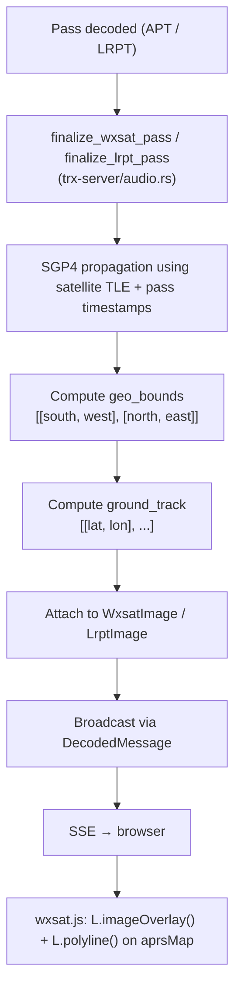

# Weather Satellite Map Overlay Integration

Overlay decoded NOAA APT and Meteor-M LRPT satellite images on the Leaflet
map module, with ground track visualisation and source filtering.

*Created: 2026-03-28*

## Status

| Step | Description | Status |
|------|-------------|--------|
| 1 | Add `sgp4` crate, create `trx-core/src/geo.rs` | Done |
| 2 | Extend `WxsatImage`/`LrptImage` with geo fields | Done |
| 3 | Compute geo-bounds in `finalize_wxsat_pass` / `finalize_lrpt_pass` | Done |
| 4 | Add `wxsat` to map source filter + image overlay rendering | Done |
| 5 | Add ground track polyline + filter toggle UI | Done |
| 6 | Build, test, verify | Done |

## Motivation

The wxsat plugin currently shows a history table with download links but has
no geographic context.  Since the Map module already renders APRS, AIS, VDES,
and FTx/WSPR positions, weather satellite images are a natural addition — they
can be projected as semi-transparent overlays on the same Leaflet map.

## Architecture

### Data flow



### Geo-referencing strategy

Weather satellites (NOAA POES, Meteor-M) fly sun-synchronous polar orbits at
~850 km altitude with known TLE parameters.  Given:

- **Satellite identity** (from telemetry: NOAA-15/18/19, Meteor-M N2-3/N2-4)
- **Pass start/end timestamps** (`pass_start_ms`, `pass_end_ms`)
- **Receiver station lat/lon** (from `RigState.server_latitude/longitude`)

We can use **SGP4 propagation** (via the `sgp4` crate) to compute the
sub-satellite ground track during the pass, then derive image bounds from the
known swath geometry:

| Parameter | NOAA APT | Meteor LRPT |
|-----------|----------|-------------|
| Altitude | ~850 km | ~825 km |
| Swath width | ~2800 km | ~2800 km |
| Ground speed | ~6.9 km/s | ~6.9 km/s |
| Scan rate | 2 lines/sec (0.5s/line) | variable MCU rate |
| Image width | 909 px/channel | 1568 px |

**Bounds computation:**
1. Propagate satellite position at `pass_start_ms` and `pass_end_ms`
2. Sub-satellite points define the ground track center line
3. Swath half-width (~1400 km) gives east/west extent
4. Image is projected as a simple lat/lon rectangle (acceptable distortion
   for the typical ~15° latitude span of a single pass)

**TLE source:** Hardcoded recent TLEs for the 5 active satellites, with an
optional HTTP refresh from CelesTrak.  Stale TLEs (weeks old) still give
sub-degree accuracy for image overlay purposes.

### Crate changes

#### `trx-core` (src/trx-core/)

New module `src/trx-core/src/geo.rs`:
- `SatelliteGeo` struct: holds hardcoded TLEs, provides `compute_pass_bounds()`
- `PassGeoBounds { south: f64, west: f64, north: f64, east: f64 }`
- `ground_track(sat, start_ms, end_ms) -> Vec<[f64; 2]>`
- Uses `sgp4` crate for orbital propagation
- Falls back to station-centered approximation when TLE unavailable

`src/trx-core/src/decode.rs` — extend structs:
```rust
pub struct WxsatImage {
    // ... existing fields ...
    pub geo_bounds: Option<[f64; 4]>,     // [south, west, north, east]
    pub ground_track: Option<Vec<[f64; 2]>>, // [[lat, lon], ...]
}
// Same for LrptImage
```

#### `trx-server` (src/trx-server/)

`src/trx-server/src/audio.rs`:
- In `finalize_wxsat_pass`: after PNG write, call `SatelliteGeo::compute_pass_bounds()`
  using satellite name, pass timestamps, and station lat/lon (threaded through
  from config).  Attach result to `WxsatImage`.
- Same for `finalize_lrpt_pass`.

#### Frontend (trx-frontend-http/assets/web/)

`plugins/wxsat.js`:
- On `onServerWxsatImage` / `onServerLrptImage`: if `geo_bounds` present,
  call `window.addWxsatMapOverlay(msg)`.
- Manage overlay list, allow removal.

`app.js`:
- Add `wxsat: false` to `DEFAULT_MAP_SOURCE_FILTER` (off by default to avoid
  visual clutter; users opt-in).
- `window.addWxsatMapOverlay(msg)`: creates `L.imageOverlay(msg.path, bounds)`
  with opacity 0.6, adds to `mapMarkers` set with `__trxType = "wxsat"`.
- `window.addWxsatGroundTrack(msg)`: creates `L.polyline(msg.ground_track)`
  with dashed style.
- Overlay list in wxsat panel with per-image show/hide toggle.

`index.html`:
- No structural changes needed; the map filter chip system auto-generates
  from `DEFAULT_MAP_SOURCE_FILTER`.

`style.css`:
- Styling for wxsat overlay opacity slider (future enhancement).

## Dependencies

| Crate | Version | Purpose |
|-------|---------|---------|
| `sgp4` | 2.4 | Pure Rust SGP4 orbital propagation |

Added to `trx-core/Cargo.toml` (used by `geo.rs`).

## Risk / Limitations

- **Rectangular projection approximation**: The actual scan geometry is curved
  (satellite moves along a great circle), but for a single pass spanning
  ~15-20° of latitude, a lat/lon rectangle is a reasonable first approximation.
  More accurate warping could use `L.imageOverlay` with a canvas transform
  in a future iteration.

- **TLE staleness**: Hardcoded TLEs drift ~0.1°/week.  For overlay purposes
  this is acceptable.  A periodic CelesTrak fetch would keep them fresh.

- **Image rotation**: Ascending vs descending passes produce different
  orientations.  The initial implementation uses axis-aligned bounds
  (no rotation).  A rotated overlay would need `leaflet-imageoverlay-rotated`
  or a canvas-based approach — deferred to a follow-up.

- **Image serving**: The `path` field is a filesystem path.  On co-located
  server/client setups this works directly.  Remote setups may need an
  image-serving endpoint (out of scope for this change).
