# Scheduler UI Improvement Plan

## Current State

The scheduler UI lives in Settings → Scheduler and provides three operational modes:

- **Grayline** — auto-switches bookmarks based on solar dawn/day/dusk/night
- **Time Span** — UTC time windows with interleaved cycling
- **Satellite Pass** — priority overlay that retunes for satellite passes

Main-view controls include a release button, prev/next step buttons, and a
progress ring showing the active interleave entry and countdown.

Key files:

| File | Purpose |
|------|---------|
| `assets/web/plugins/scheduler.js` | UI logic, rendering, API calls (~1,060 LOC) |
| `assets/web/plugins/sat-scheduler.js` | Satellite config overlay (~310 LOC) |
| `assets/web/index.html` (L1109–1289) | Scheduler settings HTML |
| `assets/web/style.css` (`.sch-*`) | Scheduler styling |
| `src/scheduler.rs` | Backend task, API handlers (~1,435 LOC) |

---

## P0 — Usability Fixes

### 1. Highlight active entry in time-span table

**Problem:** The entry table under "Entry details" has no indication of which
entry the scheduler is currently operating on. Users must cross-reference the
interleave ring label with the table manually.

**Fix:** In `renderScheduler()`, after receiving status, add/remove an
`sch-active` class on the `<tr>` whose entry id matches
`currentSchedulerStatus.last_entry_id`. Style with a left border accent
(`border-left: 3px solid var(--accent)`).

### 2. Bookmark existence validation on save

**Problem:** If a bookmark is deleted after being assigned to a scheduler entry,
the scheduler fails silently at runtime — it tries to apply a non-existent
bookmark and does nothing.

**Fix:** In `saveScheduler()`, cross-check every `bookmark_id` /
`bookmark_ids[]` against `bookmarkList`. Show a toast error listing the
broken entries and refuse to save until corrected.

### 3. Dirty-state indicator for satellite section

**Problem:** Changes in the satellite section (add/edit/remove satellites,
toggle enable) don't reliably set `schedulerDirty`, so the Save button may
not appear.

**Fix:** Audit all satellite mutation paths in `sat-scheduler.js` and ensure
they call `window.schedulerBridge.markDirty()`.

---

## P1 — Information Density & Clarity

### 4. Show local time alongside UTC

**Problem:** All times are UTC-only. Operators in non-UTC timezones must
mentally convert, especially when editing time-span entries.

**Fix:** Add a `(local)` annotation next to each UTC time display:
- In the entry table, append a dimmed local-time column
- In the timeline SVG, add a secondary tick row with local hours
- Use `Intl.DateTimeFormat` to derive the offset; no config needed

### 5. Expand entry details by default

**Problem:** The entry list is hidden behind a `<details>` collapse. New
users don't discover it, and experienced users click it open every time.

**Fix:** Default the `<details>` element to `open`. Persist the
open/collapsed preference in `localStorage`.

### 6. Richer "Now Playing" status card

**Problem:** The status card shows only `"Last applied: {name} at {time}"` —
no frequency, mode, or decoder info.

**Fix:** Extend `SchedulerStatus` (backend) to include `freq_hz`, `mode`,
and `active_decoders[]`. Render them in the status card as
`"14.074 MHz · FT8 · FT8 decoder active"`. Adds immediate visibility
without opening the bookmark manager.

---

## P2 — Interaction Improvements

### 7. Inline entry editing

**Problem:** Editing an entry requires clicking Edit, which opens an overlay
form that obscures the table. Users lose context of adjacent entries.

**Fix:** Replace the overlay with inline editing directly in the table row.
Clicking Edit on a row transforms its cells into input fields (time pickers,
selects) in-place. Save/Cancel buttons appear in the last column. This
keeps sibling entries visible and reduces clicks.

### 8. Drag-to-reorder entries

**Problem:** Entry order matters for interleave cycling, but there is no way
to reorder entries. Users must delete and re-add.

**Fix:** Add drag handles (`⠿`) to each table row. Implement HTML5 drag-and-drop
on the `<tbody>`. On drop, splice the `currentConfig.entries` array and
re-render. Mark dirty.

### 9. Timeline click-to-add

**Problem:** Adding an entry requires clicking "+ Add Entry" and manually
typing start/end times, even though the timeline is a visual 24-hour bar.

**Fix:** Make the timeline SVG interactive. Clicking on an empty region
opens the entry form pre-filled with the clicked hour as start and start+1h
as end. Dragging across a region sets start/end from the drag span. Use
`pointer-events` and `getBoundingClientRect()` to map pixel → minute.

### 10. Improved extra-channels management

**Problem:** Virtual channels use tiny `+`/`−` buttons with no indication
of which bookmarks are already added. Removing a channel requires clicking
`−` on the right one in a compact list.

**Fix:** Replace with a multi-select chip list: each added channel is a
removable chip (`× 40m FT8`). The `+` button opens the select dropdown.
Already-added bookmarks are disabled in the dropdown to prevent duplicates.

---

## P3 — Feature Enhancements

### 11. Grayline location lookup by grid square

**Problem:** Users must manually enter latitude/longitude. Ham operators
typically know their Maidenhead grid square (e.g. `JO94`) but not their
coordinates to three decimals.

**Fix:** Add a text input for grid square next to the lat/lon fields. On
input, convert the grid square to lat/lon using the standard Maidenhead
algorithm (simple arithmetic, no external API). Populate lat/lon fields
automatically. Also support reverse: when lat/lon changes, show the
derived grid square.

### 12. Expanded satellite preset library

**Problem:** Only two satellite presets (Meteor-M2 3 and M2-4). Adding
NOAA, ISS, or amateur satellites requires looking up NORAD IDs externally.

**Fix:** Expand the preset `<option>` list to include common amateur /
weather satellites:

```
ISS (145.825 MHz APRS)     — 25544
SO-50 (436.795 MHz FM)     — 27607
```

Low-effort, high-value change — just HTML `<option>` additions plus
corresponding default bookmark templates.

### 13. Scheduler activity log

**Problem:** No way to see what the scheduler did historically — when it
switched, which bookmark it applied, whether any entry was skipped.

**Fix:**
- Backend: Add a ring buffer (last 100 events) to `SchedulerState`.
  Each event: `{ utc, action: "applied"|"skipped"|"satellite_aos"|"satellite_los", entry_label, bookmark_name }`.
- API: `GET /scheduler/{rig_id}/log` returns the buffer.
- UI: Add a collapsible "Activity Log" section below the status card.
  Render as a reverse-chronological compact list with timestamps.

### 14. Timeline interleave visualization

**Problem:** When multiple entries overlap, the timeline shows overlapping
colored bars but gives no indication of how interleaving splits time between
them.

**Fix:** When interleave is enabled and entries overlap, render alternating
color stripes within the overlap region (e.g., 5-minute tick marks colored
per-entry). Add a legend showing entry label → color mapping.

### 15. Keyboard shortcuts for scheduler control

**Problem:** Release/step controls require mouse clicks on the main view.
During operation, keyboard shortcuts would be faster.

**Fix:** Register global keybindings (configurable in settings):
- `Shift+R` — toggle release to scheduler
- `Shift+N` / `Shift+P` — step to next/previous entry

Guard with `!isInputFocused()` to avoid conflicts with text fields.

---

## Implementation Order

```mermaid
gantt
    title Scheduler UI Improvements
    dateFormat X
    axisFormat %s

    section P0
    Active entry highlight         :1, 2
    Bookmark validation            :1, 2
    Satellite dirty-state fix      :1, 2

    section P1
    Local time display             :3, 5
    Expand details by default      :3, 4
    Richer status card             :3, 5

    section P2
    Inline entry editing           :6, 9
    Drag-to-reorder                :6, 8
    Timeline click-to-add          :6, 9
    Extra-channels chips           :6, 8

    section P3
    Grid square lookup             :10, 11
    Satellite presets              :10, 11
    Activity log                   :10, 13
    Interleave visualization       :10, 13
    Keyboard shortcuts             :10, 11
```



P0 items are small, targeted fixes (< 1 hour each). P1 items improve daily
usability. P2 items modernize interactions. P3 items add new capabilities.
Each item is independently shippable.
