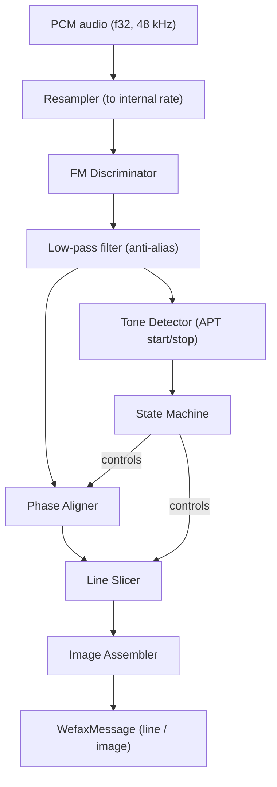
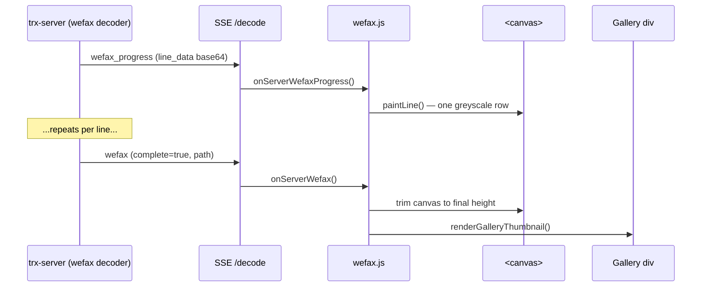

# WEFAX / Radiofax Decoder Implementation Plan

> **Crate**: `trx-wefax` &mdash; `src/decoders/trx-wefax/`
> **Status**: Draft &mdash; 2026-04-02

## 1. Overview

WEFAX (Weather Facsimile, ITU-T T.4 / WMO) is an analog image transmission
mode used by meteorological agencies worldwide (NOAA, DWD, JMH, etc.) on HF
and satellite downlinks. The decoder converts FM-modulated audio tones into
greyscale (or colour-composited) image lines.

### Goals

- Pure Rust, zero C FFI dependencies (matching project conventions).
- Multi-speed support: **60, 90, 120, 240 LPM** (lines per minute).
- Multi-IOC support: **288 and 576** (Index of Cooperation &mdash; defines
  line pixel width).
- Automatic start/stop detection via APT tones.
- Phase-aligned line assembly from phasing signal.
- Incremental image output (line-by-line progress + final PNG).
- Follow existing decoder patterns (`process_block` / `decode_if_ready`).

## 2. WEFAX Signal Structure

```
Carrier (1900 Hz center, ±400 Hz deviation)
  Black = 1500 Hz
  White = 2300 Hz
  (linear mapping between frequency and luminance)

Transmission sequence:
  ┌─────────────┐
  │ Start tone   │  300 Hz (5s) or 675 Hz (3s) — selects IOC 576 / 288
  ├─────────────┤
  │ Phasing      │  >95% white line + narrow black pulse — phase alignment
  │ (30 lines)   │
  ├─────────────┤
  │ Image lines  │  N lines at configured LPM
  ├─────────────┤
  │ Stop tone    │  450 Hz (5s) — signals end of transmission
  └─────────────┘
```

### Key parameters

| Parameter | IOC 576 | IOC 288 |
|-----------|---------|---------|
| Pixels per line | 1809 | 904 |
| Line duration (120 LPM) | 500 ms | 500 ms |
| Line duration (60 LPM) | 1000 ms | 1000 ms |
| Pixel clock | ~3618 px/s (120 LPM) | ~1808 px/s (120 LPM) |

Pixel count per line = `IOC × π` (rounded: 576×π ≈ 1809, 288×π ≈ 904).

## 3. Architecture



### Internal sample rate

Resample input to **11,025 Hz** (sufficient for 2300 Hz max tone with
comfortable margin; matches common WEFAX decoder practice and keeps DSP
cost low).

## 4. Module Layout

```
src/decoders/trx-wefax/
  Cargo.toml
  src/
    lib.rs              # Public API: WefaxDecoder, WefaxConfig, WefaxEvent
    decoder.rs          # Top-level decoder state machine + process_block/decode_if_ready
    demod.rs            # FM discriminator (instantaneous frequency from analytic signal)
    tone_detect.rs      # Goertzel-based APT tone detector (300/450/675 Hz)
    phase.rs            # Phasing signal detector and line-start alignment
    line_slicer.rs      # Pixel clock recovery, line buffer assembly
    resampler.rs        # Polyphase rational resampler (48k → 11025)
    image.rs            # Image buffer, PNG encoding, optional colour compositing
    config.rs           # WefaxConfig: speed, IOC, auto-detect, output path
```

## 5. Core Types

### 5.1 Configuration

```rust
pub struct WefaxConfig {
    /// Lines per minute: 60, 90, 120, 240. `None` = auto-detect from APT.
    pub lpm: Option<u16>,
    /// Index of Cooperation: 288 or 576. `None` = auto-detect from start tone.
    pub ioc: Option<u16>,
    /// Centre frequency of the FM subcarrier (default 1900 Hz).
    pub center_freq_hz: f32,
    /// Deviation (default ±400 Hz, so black=1500, white=2300).
    pub deviation_hz: f32,
    /// Directory for saving decoded images.
    pub output_dir: Option<String>,
    /// Whether to emit line-by-line progress events.
    pub emit_progress: bool,
}
```

### 5.2 Decoder state machine

```rust
pub enum WefaxState {
    /// Listening for APT start tone.
    Idle,
    /// Start tone detected; waiting for phasing signal.
    StartDetected { ioc: u16, tone_start_sample: u64 },
    /// Receiving phasing lines; aligning line-start phase.
    Phasing { ioc: u16, lpm: u16, phase_offset: Option<usize> },
    /// Actively decoding image lines.
    Receiving { ioc: u16, lpm: u16, line_number: u32 },
    /// Stop tone detected; finalising image.
    Stopping,
}
```

### 5.3 Output messages (for `trx-core::DecodedMessage`)

```rust
/// A complete or in-progress WEFAX image.
pub struct WefaxMessage {
    pub rig_id: Option<String>,
    pub ts_ms: Option<i64>,
    /// Number of image lines decoded so far.
    pub line_count: u32,
    /// Detected or configured LPM.
    pub lpm: u16,
    /// Detected or configured IOC.
    pub ioc: u16,
    /// Pixels per line (IOC × π, rounded).
    pub pixels_per_line: u16,
    /// Filesystem path to saved PNG (set on completion).
    pub path: Option<String>,
    /// True when image is complete (stop tone received).
    pub complete: bool,
}

/// Progress update emitted every N lines during active reception.
pub struct WefaxProgress {
    pub rig_id: Option<String>,
    pub line_count: u32,
    pub lpm: u16,
    pub ioc: u16,
}
```

## 6. DSP Pipeline Detail

### 6.1 Resampling

Rational polyphase resampler: 48000 → 11025 Hz (ratio 441/1920, simplified
from 11025/48000). Follow `docs/Optimization-Guidelines.md` polyphase
resampler guidance. Same pattern as FT8 decoder's 48k→12k resampler.

### 6.2 FM Discriminator

Compute instantaneous frequency from the analytic signal:

1. **Hilbert transform** (FIR, 65-tap) to produce analytic signal `z[n]`.
2. **Instantaneous frequency**: `f[n] = arg(z[n] · conj(z[n-1])) / (2π·Ts)`
3. Map frequency to luminance: `pixel = clamp((f - 1500) / 800, 0, 1)`.

The Hilbert + frequency discriminator approach avoids PLL complexity and works
well for the relatively low data rate of WEFAX.

### 6.3 APT Tone Detection

Use **Goertzel filters** at three frequencies (matching `trx-cw` pattern):

| Tone | Frequency | Meaning |
|------|-----------|---------|
| Start (IOC 576) | 300 Hz | Begin reception, IOC=576 |
| Start (IOC 288) | 675 Hz | Begin reception, IOC=288 |
| Stop | 450 Hz | End of transmission |

Detection window: ~200 ms (2205 samples at 11025 Hz). Require sustained
detection for ≥1.5 s to confirm (debounce against noise). Energy ratio
vs broadband noise for reliability.

### 6.4 Phasing Signal Detection

During phasing, each line is >95% white (2300 Hz) with a narrow black pulse
(~5% of line width) at the line-start position.

1. After start tone, begin accumulating demodulated samples.
2. Slice into line-duration windows (e.g., 500 ms for 120 LPM).
3. Cross-correlate against expected phasing template (short black pulse).
4. Average pulse position over 10+ phasing lines → line-start phase offset.
5. Transition to `Receiving` once phase is stable (variance < 2 samples).

### 6.5 Line Slicing and Pixel Clock

Once phased:

1. Accumulate demodulated (frequency → luminance) samples.
2. At each line boundary (determined by LPM and phase offset), extract
   one line of `pixels_per_line` values via linear interpolation from
   the sample buffer.
3. Push completed line into the image assembler.
4. Emit `WefaxProgress` every 50 lines (configurable).

### 6.6 Image Assembly

- Maintain a `Vec<Vec<u8>>` of greyscale lines (0–255).
- On stop tone or manual stop: encode to 8-bit greyscale PNG.
- Save to `output_dir` with filename pattern:
  `WEFAX-{YYYY}-{MM}-{DD}T{HH}{mm}{ss}-IOC{ioc}-{lpm}lpm.png`
- Return `WefaxMessage` with `complete: true` and `path` set.

## 7. Integration with trx-rs

### 7.1 Workspace registration

Add to root `Cargo.toml` workspace members:

```toml
"src/decoders/trx-wefax"
```

### 7.2 `trx-core` changes

Add variants to `DecodedMessage`:

```rust
#[serde(rename = "wefax")]
Wefax(WefaxMessage),
#[serde(rename = "wefax_progress")]
WefaxProgress(WefaxProgress),
```

Update `set_rig_id()` / `rig_id()` match arms.

### 7.3 `trx-server` integration

Add `run_wefax_decoder()` in `audio.rs` following the existing pattern:

```rust
pub async fn run_wefax_decoder(
    sample_rate: u32,
    channels: u16,
    mut pcm_rx: broadcast::Receiver<Vec<f32>>,
    state_rx: watch::Receiver<RigState>,
    decode_tx: broadcast::Sender<DecodedMessage>,
    logs: Option<Arc<DecoderLoggers>>,
    histories: Arc<DecoderHistories>,
)
```

Spawn in `main.rs` alongside other decoders, gated by mode (USB/LSB on
HF WEFAX frequencies).

### 7.4 History and logging

- Add `wefax: Arc<Mutex<VecDeque<WefaxMessage>>>` to `DecoderHistories`.
- Add optional `wefax` logger to `DecoderLoggers` (JSON Lines).

### 7.5 Frontend exposure

The web frontend follows the existing decoder plugin pattern used by WSPR,
FT8, AIS, etc. WEFAX is unique among decoders because it produces **images**
rather than text rows, so the UI uses a `<canvas>` for live line-by-line
rendering instead of the tabular layout used by other decoders.

#### 7.5.1 Rust backend wiring (`trx-frontend-http`)

**`src/status.rs`** &mdash; embed the plugin script:

```rust
pub const WEFAX_JS: &str = include_str!("../assets/web/plugins/wefax.js");
```

**`src/api/assets.rs`** &mdash; define the gzip-cached route:

```rust
define_gz_cache!(gz_wefax_js, status::WEFAX_JS, "wefax.js");

#[get("/wefax.js")]
pub(crate) async fn wefax_js(req: HttpRequest) -> impl Responder {
    let c = gz_wefax_js();
    static_asset_response(&req, "application/javascript; charset=utf-8", c)
}
```

**`src/api/decoder.rs`** &mdash; add endpoints:

```rust
#[post("/toggle_wefax_decode")]
pub async fn toggle_wefax_decode(
    query: web::Query<RemoteQuery>,
    state: web::Data<watch::Receiver<RigState>>,
    rig_tx: web::Data<mpsc::Sender<RigRequest>>,
) -> Result<HttpResponse, Error> {
    let enabled = state.get_ref().borrow().decoders.wefax_decode_enabled;
    send_command(
        &rig_tx,
        RigCommand::SetWefaxDecodeEnabled(!enabled),
        query.into_inner().remote,
    )
    .await
}

#[post("/clear_wefax_decode")]
pub async fn clear_wefax_decode(
    query: web::Query<RemoteQuery>,
    context: web::Data<Arc<FrontendRuntimeContext>>,
    rig_tx: web::Data<mpsc::Sender<RigRequest>>,
) -> Result<HttpResponse, Error> {
    crate::server::audio::clear_wefax_history(context.get_ref());
    send_command(
        &rig_tx,
        RigCommand::ResetWefaxDecoder,
        query.into_inner().remote,
    )
    .await
}
```

**`src/api/mod.rs`** &mdash; register in `configure()`:

```rust
.service(decoder::toggle_wefax_decode)
.service(decoder::clear_wefax_decode)
.service(assets::wefax_js)
```

**Decode history** &mdash; add `"wefax"` key to the CBOR payload returned
by `GET /decode/history`, containing `Vec<WefaxMessage>` (completed images
only; in-progress images are streamed via SSE).

**SSE `/decode` stream** &mdash; broadcast two event shapes:

```json
{"wefax_progress": {"line_count": 142, "lpm": 120, "ioc": 576, "pixels_per_line": 1809,
                     "line_data": "<base64-encoded u8 greyscale row>"}}

{"wefax": {"ts_ms": 1712000000000, "line_count": 800, "lpm": 120, "ioc": 576,
           "pixels_per_line": 1809, "complete": true,
           "path": "/images/WEFAX-2026-04-02T1430-IOC576-120lpm.png"}}
```

`wefax_progress` events carry a base64 `line_data` field (one image row of
greyscale bytes) so the browser can paint each line as it arrives without
needing a separate WebSocket channel.

**Decoder registry** &mdash; add entry to `DECODER_REGISTRY` in
`trx-protocol`:

```rust
DecoderRegistryEntry {
    id: "wefax",
    label: "WEFAX",
    activation: "toggle",       // enable/disable button
    active_modes: &["usb", "lsb", "am"],
    background_decode: false,
    bookmark_selectable: true,
}
```

#### 7.5.2 HTML additions (`index.html`)

**Sub-tab button** (inside `.sub-tab-bar`, after the existing decoder
buttons):

```html
<button class="sub-tab" data-subtab="wefax" id="subtab-wefax">WEFAX</button>
```

**Sub-tab panel** (alongside other `sub-tab-panel` divs):

```html
<div id="subtab-wefax" class="sub-tab-panel" style="display:none;">
  <div class="ft8-controls">
    <button id="wefax-decode-toggle-btn" type="button">Enable WEFAX</button>
    <button id="wefax-clear-btn" type="button"
            style="margin-left:0.5rem; font-size:0.8rem;">Clear</button>
    <small id="wefax-status" style="color:var(--text-muted);">Idle</small>
  </div>

  <!-- Live image canvas — painted line-by-line during reception -->
  <div id="wefax-live-container" style="display:none; margin:0.5rem 0;">
    <div style="display:flex; align-items:center; gap:0.5rem; margin-bottom:0.3rem;">
      <strong>Receiving</strong>
      <small id="wefax-live-info" style="color:var(--text-muted);"></small>
    </div>
    <canvas id="wefax-live-canvas" width="1809" height="800"
            style="width:100%; image-rendering:pixelated; background:#000;"></canvas>
  </div>

  <!-- Gallery of completed images -->
  <div id="wefax-gallery" style="display:flex; flex-wrap:wrap; gap:0.5rem;"></div>
</div>
```

**Overview section** (inside the digital-modes overview panel):

```html
<div class="plugin-item" data-decoder="wefax">
  <strong>WEFAX Decoder</strong>
  <div style="color:var(--text-muted); font-size:0.85rem; margin-top:0.2rem;">
    Weather Facsimile &mdash; HF/satellite image reception (60/90/120/240 LPM)
  </div>
</div>
```

**About section** (in the About tab decoder list):

```html
<tr id="about-dec-wefax"><td>WEFAX</td><td>Weather Facsimile decoder</td></tr>
```

#### 7.5.3 Plugin script registration

**`index.html` plugin map** &mdash; add `'/wefax.js'` to the
`'digital-modes'` array in `pluginScripts`:

```javascript
var pluginScripts = {
  'digital-modes': ['/ft8.js', ..., '/wefax.js'],
  // ...
};
```

#### 7.5.4 SSE dispatch in `app.js`

Add WEFAX to the decode event dispatcher (inside `decodeSource.onmessage`):

```javascript
if (msg.wefax_progress && window.onServerWefaxProgress) {
  window.onServerWefaxProgress(msg.wefax_progress);
}
if (msg.wefax && window.onServerWefax) {
  window.onServerWefax(msg.wefax);
}
```

Add `"wefax"` to the decode history restore loop:

```javascript
// In loadDecodeHistoryOnMainThread / worker dispatch:
const HISTORY_GROUP_KEYS = ["ais", "vdes", "aprs", "hf_aprs",
                            "cw", "ft8", "ft4", "ft2", "wspr", "wefax"];
```

Add WEFAX to `restoreDecodeHistoryGroup()`:

```javascript
case "wefax":
  if (window.restoreWefaxHistory) window.restoreWefaxHistory(messages);
  break;
```

#### 7.5.5 Plugin file (`assets/web/plugins/wefax.js`)

Full plugin structure following the project's vanilla-JS decoder plugin
pattern:

```javascript
// ---------------------------------------------------------------------------
// wefax.js — WEFAX decoder plugin for trx-frontend-http
// ---------------------------------------------------------------------------

// --- DOM refs ---
const wefaxStatus       = document.getElementById('wefax-status');
const wefaxLiveContainer= document.getElementById('wefax-live-container');
const wefaxLiveInfo     = document.getElementById('wefax-live-info');
const wefaxLiveCanvas   = document.getElementById('wefax-live-canvas');
const wefaxGallery      = document.getElementById('wefax-gallery');
const wefaxToggleBtn    = document.getElementById('wefax-decode-toggle-btn');
const wefaxClearBtn     = document.getElementById('wefax-clear-btn');

// --- State ---
let wefaxImageHistory  = [];   // completed WefaxMessage objects
let wefaxLiveCtx       = null; // canvas 2D context
let wefaxLiveLineCount = 0;    // lines painted so far
let wefaxLivePixelsPerLine = 1809;

// --- Helpers ---
function currentWefaxHistoryRetentionMs() {
  return window.getDecodeHistoryRetentionMs?.() || 24 * 60 * 60 * 1000;
}

function pruneWefaxHistory() {
  const cutoff = Date.now() - currentWefaxHistoryRetentionMs();
  wefaxImageHistory = wefaxImageHistory.filter(m => (m._tsMs || 0) > cutoff);
}

function escapeHtml(s) {
  return String(s)
    .replaceAll('&', '&amp;')
    .replaceAll('<', '&lt;')
    .replaceAll('>', '&gt;')
    .replaceAll('"', '&quot;');
}

// --- Live canvas rendering ---

/** Reset canvas for a new image reception. */
function resetLiveCanvas(pixelsPerLine) {
  wefaxLivePixelsPerLine = pixelsPerLine;
  wefaxLiveLineCount = 0;
  wefaxLiveCanvas.width = pixelsPerLine;
  wefaxLiveCanvas.height = 800; // grows if needed
  wefaxLiveCtx = wefaxLiveCanvas.getContext('2d');
  wefaxLiveCtx.fillStyle = '#000';
  wefaxLiveCtx.fillRect(0, 0, wefaxLiveCanvas.width, wefaxLiveCanvas.height);
  wefaxLiveContainer.style.display = '';
}

/** Append one greyscale line (Uint8Array) to the live canvas. */
function paintLine(lineBytes) {
  if (!wefaxLiveCtx) return;
  const y = wefaxLiveLineCount;

  // Grow canvas vertically if needed (double height strategy).
  if (y >= wefaxLiveCanvas.height) {
    const old = wefaxLiveCtx.getImageData(
      0, 0, wefaxLiveCanvas.width, wefaxLiveCanvas.height);
    wefaxLiveCanvas.height *= 2;
    wefaxLiveCtx.putImageData(old, 0, 0);
  }

  const w = wefaxLivePixelsPerLine;
  const imgData = wefaxLiveCtx.createImageData(w, 1);
  const d = imgData.data;
  for (let x = 0; x < w; x++) {
    const v = x < lineBytes.length ? lineBytes[x] : 0;
    const i = x * 4;
    d[i] = v; d[i + 1] = v; d[i + 2] = v; d[i + 3] = 255;
  }
  wefaxLiveCtx.putImageData(imgData, 0, y);
  wefaxLiveLineCount++;
}

// --- Gallery rendering ---

function renderGalleryThumbnail(msg) {
  const card = document.createElement('div');
  card.className = 'wefax-card';
  card.style.cssText =
    'border:1px solid var(--border-color); border-radius:4px; ' +
    'padding:0.4rem; max-width:280px; cursor:pointer;';

  const ts = msg._tsMs
    ? new Date(msg._tsMs).toLocaleString()
    : '—';
  const info = `${msg.ioc} IOC · ${msg.lpm} LPM · ${msg.line_count} lines`;

  // If a server path is available, show a thumbnail linking to it.
  if (msg.path) {
    card.innerHTML =
      `` +
      `<div style="font-size:0.8rem; margin-top:0.2rem;">${escapeHtml(ts)}</div>` +
      `<div style="font-size:0.75rem; color:var(--text-muted);">${info}</div>`;
  } else {
    card.innerHTML =
      `<div style="font-size:0.8rem;">${escapeHtml(ts)}</div>` +
      `<div style="font-size:0.75rem; color:var(--text-muted);">${info}</div>`;
  }
  return card;
}

function renderWefaxGallery() {
  pruneWefaxHistory();
  const frag = document.createDocumentFragment();
  for (const msg of wefaxImageHistory) {
    frag.appendChild(renderGalleryThumbnail(msg));
  }
  wefaxGallery.innerHTML = '';
  wefaxGallery.appendChild(frag);
}

function scheduleWefaxGalleryRender() {
  if (window.trxScheduleUiFrameJob) {
    window.trxScheduleUiFrameJob('wefax-gallery', renderWefaxGallery);
  } else {
    requestAnimationFrame(renderWefaxGallery);
  }
}

// --- SSE event handlers (public API) ---

/** Called for each wefax_progress SSE event (one image line). */
window.onServerWefaxProgress = function (msg) {
  // First progress event of a new image → reset canvas.
  if (msg.line_count <= 1 || !wefaxLiveCtx) {
    resetLiveCanvas(msg.pixels_per_line || 1809);
  }

  // Decode base64 line_data → Uint8Array → paint.
  if (msg.line_data) {
    const binary = atob(msg.line_data);
    const bytes = new Uint8Array(binary.length);
    for (let i = 0; i < binary.length; i++) bytes[i] = binary.charCodeAt(i);
    paintLine(bytes);
  }

  // Update status text.
  if (wefaxLiveInfo) {
    wefaxLiveInfo.textContent =
      `Line ${msg.line_count} · ${msg.ioc} IOC · ${msg.lpm} LPM`;
  }
  if (wefaxStatus) {
    wefaxStatus.textContent = `Receiving — line ${msg.line_count}`;
    wefaxStatus.style.color = 'var(--text-accent)';
  }
};

/** Called when a complete WEFAX image is received. */
window.onServerWefax = function (msg) {
  msg._tsMs = msg.ts_ms || Date.now();
  wefaxImageHistory.unshift(msg);
  pruneWefaxHistory();
  scheduleWefaxGalleryRender();

  // Finalise live canvas — trim height to actual line count.
  if (wefaxLiveCtx && wefaxLiveLineCount > 0) {
    const trimmed = wefaxLiveCtx.getImageData(
      0, 0, wefaxLiveCanvas.width, wefaxLiveLineCount);
    wefaxLiveCanvas.height = wefaxLiveLineCount;
    wefaxLiveCtx.putImageData(trimmed, 0, 0);
  }

  if (wefaxStatus) {
    wefaxStatus.textContent = `Complete — ${msg.line_count} lines`;
    wefaxStatus.style.color = '';
  }
};

/** Batch restore from decode history (page load). */
window.restoreWefaxHistory = function (messages) {
  if (!messages || !messages.length) return;
  for (const m of messages) {
    m._tsMs = m.ts_ms || Date.now();
  }
  wefaxImageHistory = messages.concat(wefaxImageHistory);
  pruneWefaxHistory();
  scheduleWefaxGalleryRender();
};

/** Called by history retention pruning cycle. */
window.pruneWefaxHistoryView = function () {
  pruneWefaxHistory();
  scheduleWefaxGalleryRender();
};

/** Full reset (rig change, clear). */
window.resetWefaxHistoryView = function () {
  wefaxImageHistory = [];
  wefaxGallery.innerHTML = '';
  wefaxLiveContainer.style.display = 'none';
  wefaxLiveCtx = null;
  wefaxLiveLineCount = 0;
  if (wefaxStatus) {
    wefaxStatus.textContent = 'Idle';
    wefaxStatus.style.color = '';
  }
};

// --- Button handlers ---
if (wefaxClearBtn) {
  wefaxClearBtn.addEventListener('click', function () {
    fetch('/clear_wefax_decode', { method: 'POST' });
    window.resetWefaxHistoryView();
  });
}
```

#### 7.5.6 Data flow summary



#### 7.5.7 Image serving

Completed PNG files saved by the decoder need an HTTP route for browser
access. Add a static-file route in `assets.rs`:

```rust
#[get("/images/{filename}")]
pub(crate) async fn wefax_image(
    req: HttpRequest,
    path: web::Path<String>,
) -> impl Responder {
    // Serve from WefaxConfig::output_dir, validate filename (no path traversal).
    // Content-Type: image/png, Cache-Control: public, max-age=86400.
}
```

Register in `api/mod.rs`:

```rust
.service(assets::wefax_image)
```

#### 7.5.8 Decode history worker update

Add `"wefax"` to `HISTORY_GROUP_KEYS` in `decode-history-worker.js`:

```javascript
const HISTORY_GROUP_KEYS = [
  "ais", "vdes", "aprs", "hf_aprs", "cw",
  "ft8", "ft4", "ft2", "wspr", "wefax"
];
```

## 8. Implementation Phases

### Phase 1: Core DSP (MVP)

1. **Resampler** &mdash; 48k→11025 polyphase resampler with tests.
2. **FM discriminator** &mdash; Hilbert FIR + instantaneous freq, verify
   against synthetic 1500–2300 Hz sweeps.
3. **Tone detector** &mdash; Goertzel at 300/450/675 Hz with debounce.
4. **Line slicer** &mdash; Fixed-config (manual LPM+IOC) line extraction.
5. **Image buffer + PNG** &mdash; Greyscale line accumulation, `image` or
   `png` crate for encoding.

Deliverable: decode a known WEFAX WAV recording at a single speed/IOC.

### Phase 2: Automatic Detection

6. **State machine** &mdash; Full `Idle→StartDetected→Phasing→Receiving→Stopping`
   transitions driven by tone detector.
7. **Phase alignment** &mdash; Cross-correlation phasing detector.
8. **Auto IOC/LPM** &mdash; IOC from start tone frequency; LPM from phasing
   line duration measurement.

Deliverable: fully automatic reception of a single image without manual config.

### Phase 3: Server Integration

9. **`trx-core` message types** &mdash; `WefaxMessage`, `WefaxProgress` in
   `DecodedMessage`.
10. **`trx-server` task** &mdash; `run_wefax_decoder()`, history, logging.
11. **Protocol registry** &mdash; `DECODER_REGISTRY` entry for `"wefax"`.

Deliverable: backend wefax decoding with SSE event broadcast.

### Phase 3b: Frontend Wiring

12. **Rust asset pipeline** &mdash; `status.rs` embed, `assets.rs` gzip
    cache + route, `decoder.rs` toggle/clear endpoints, `api/mod.rs`
    registration (§7.5.1).
13. **HTML scaffold** &mdash; sub-tab button, sub-tab panel with canvas +
    gallery, overview entry, about row (§7.5.2).
14. **Plugin loading** &mdash; add `/wefax.js` to `pluginScripts`
    `'digital-modes'` array (§7.5.3).
15. **SSE dispatch** &mdash; `wefax` / `wefax_progress` handlers in
    `app.js` decode event dispatcher (§7.5.4).
16. **`wefax.js` plugin** &mdash; live canvas rendering, gallery
    thumbnails, history restore, toggle/clear wiring (§7.5.5).
17. **Image serving** &mdash; `/images/{filename}` static route for
    completed PNGs (§7.5.7).
18. **History worker** &mdash; add `"wefax"` to `HISTORY_GROUP_KEYS`
    (§7.5.8).

Deliverable: end-to-end live WEFAX decoding with in-browser image preview.

### Phase 4: Polish

19. **Multi-speed runtime switching** &mdash; handle back-to-back
    transmissions at different LPM within one session.
20. **Slant correction** &mdash; fine-tune sample clock drift compensation
    using phasing pulse tracking.
21. **Colour compositing** &mdash; optional IR + visible overlay for
    satellite WEFAX (future).
22. **Test suite** &mdash; synthetic signal generation, round-trip tests,
    edge cases (partial images, noise, frequency offset).

## 9. Dependencies

```toml
[dependencies]
trx-core = { path = "../../trx-core" }
rustfft = "6"          # Hilbert transform FIR via FFT overlap-save (optional)
png = "0.17"           # PNG encoding (lightweight, no image full dep)
```

No additional heavy dependencies required. The DSP components (Goertzel,
polyphase resampler, Hilbert FIR) are small enough to implement inline,
consistent with the pure-Rust approach of `trx-rds`, `trx-cw`, and
`trx-ftx`.

## 10. Testing Strategy

| Test | Method |
|------|--------|
| FM discriminator accuracy | Synthesise known-frequency tones, verify ±1 Hz |
| Tone detection | Inject 300/450/675 Hz bursts, verify timing |
| Phase alignment | Synthetic phasing signal with known pulse position |
| Line pixel accuracy | Known gradient pattern → verify pixel values |
| Full decode round-trip | Reference WEFAX WAV → compare output PNG against known-good |
| Multi-speed switching | Sequential 120 LPM + 60 LPM images in one stream |
| Noise resilience | Add white noise at various SNR, verify graceful degradation |

## 11. References

- ITU-R BT.601 (facsimile signal characteristics)
- WMO Manual on the GTS, Attachment II-13 (HF radiofax schedule/format)
- NOAA Radiofax Charts: frequency schedules and IOC/LPM per product
- Existing open-source implementations: `fldigi` WEFAX module, `multimon-ng`
