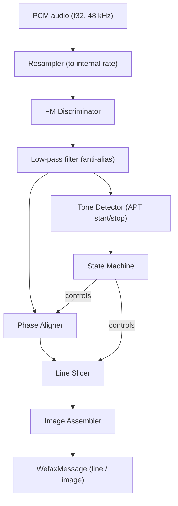

# WEFAX / Radiofax Decoder Implementation Plan

> **Crate**: `trx-wefax` &mdash; `src/decoders/trx-wefax/`
> **Status**: Draft &mdash; 2026-04-02

## 1. Overview

WEFAX (Weather Facsimile, ITU-T T.4 / WMO) is an analog image transmission
mode used by meteorological agencies worldwide (NOAA, DWD, JMH, etc.) on HF
and satellite downlinks. The decoder converts FM-modulated audio tones into
greyscale (or colour-composited) image lines.

### Goals

- Pure Rust, zero C FFI dependencies (matching project conventions).
- Multi-speed support: **60, 90, 120, 240 LPM** (lines per minute).
- Multi-IOC support: **288 and 576** (Index of Cooperation &mdash; defines
  line pixel width).
- Automatic start/stop detection via APT tones.
- Phase-aligned line assembly from phasing signal.
- Incremental image output (line-by-line progress + final PNG).
- Follow existing decoder patterns (`process_block` / `decode_if_ready`).

## 2. WEFAX Signal Structure

```
Carrier (1900 Hz center, ±400 Hz deviation)
  Black = 1500 Hz
  White = 2300 Hz
  (linear mapping between frequency and luminance)

Transmission sequence:
  ┌─────────────┐
  │ Start tone   │  300 Hz (5s) or 675 Hz (3s) — selects IOC 576 / 288
  ├─────────────┤
  │ Phasing      │  >95% white line + narrow black pulse — phase alignment
  │ (30 lines)   │
  ├─────────────┤
  │ Image lines  │  N lines at configured LPM
  ├─────────────┤
  │ Stop tone    │  450 Hz (5s) — signals end of transmission
  └─────────────┘
```

### Key parameters

| Parameter | IOC 576 | IOC 288 |
|-----------|---------|---------|
| Pixels per line | 1809 | 904 |
| Line duration (120 LPM) | 500 ms | 500 ms |
| Line duration (60 LPM) | 1000 ms | 1000 ms |
| Pixel clock | ~3618 px/s (120 LPM) | ~1808 px/s (120 LPM) |

Pixel count per line = `IOC × π` (rounded: 576×π ≈ 1809, 288×π ≈ 904).

## 3. Architecture



### Internal sample rate

Resample input to **11,025 Hz** (sufficient for 2300 Hz max tone with
comfortable margin; matches common WEFAX decoder practice and keeps DSP
cost low).

## 4. Module Layout

```
src/decoders/trx-wefax/
  Cargo.toml
  src/
    lib.rs              # Public API: WefaxDecoder, WefaxConfig, WefaxEvent
    decoder.rs          # Top-level decoder state machine + process_block/decode_if_ready
    demod.rs            # FM discriminator (instantaneous frequency from analytic signal)
    tone_detect.rs      # Goertzel-based APT tone detector (300/450/675 Hz)
    phase.rs            # Phasing signal detector and line-start alignment
    line_slicer.rs      # Pixel clock recovery, line buffer assembly
    resampler.rs        # Polyphase rational resampler (48k → 11025)
    image.rs            # Image buffer, PNG encoding, optional colour compositing
    config.rs           # WefaxConfig: speed, IOC, auto-detect, output path
```

## 5. Core Types

### 5.1 Configuration

```rust
pub struct WefaxConfig {
    /// Lines per minute: 60, 90, 120, 240. `None` = auto-detect from APT.
    pub lpm: Option<u16>,
    /// Index of Cooperation: 288 or 576. `None` = auto-detect from start tone.
    pub ioc: Option<u16>,
    /// Centre frequency of the FM subcarrier (default 1900 Hz).
    pub center_freq_hz: f32,
    /// Deviation (default ±400 Hz, so black=1500, white=2300).
    pub deviation_hz: f32,
    /// Directory for saving decoded images.
    pub output_dir: Option<String>,
    /// Whether to emit line-by-line progress events.
    pub emit_progress: bool,
}
```

### 5.2 Decoder state machine

```rust
pub enum WefaxState {
    /// Listening for APT start tone.
    Idle,
    /// Start tone detected; waiting for phasing signal.
    StartDetected { ioc: u16, tone_start_sample: u64 },
    /// Receiving phasing lines; aligning line-start phase.
    Phasing { ioc: u16, lpm: u16, phase_offset: Option<usize> },
    /// Actively decoding image lines.
    Receiving { ioc: u16, lpm: u16, line_number: u32 },
    /// Stop tone detected; finalising image.
    Stopping,
}
```

### 5.3 Output messages (for `trx-core::DecodedMessage`)

```rust
/// A complete or in-progress WEFAX image.
pub struct WefaxMessage {
    pub rig_id: Option<String>,
    pub ts_ms: Option<i64>,
    /// Number of image lines decoded so far.
    pub line_count: u32,
    /// Detected or configured LPM.
    pub lpm: u16,
    /// Detected or configured IOC.
    pub ioc: u16,
    /// Pixels per line (IOC × π, rounded).
    pub pixels_per_line: u16,
    /// Filesystem path to saved PNG (set on completion).
    pub path: Option<String>,
    /// True when image is complete (stop tone received).
    pub complete: bool,
}

/// Progress update emitted every N lines during active reception.
pub struct WefaxProgress {
    pub rig_id: Option<String>,
    pub line_count: u32,
    pub lpm: u16,
    pub ioc: u16,
}
```

## 6. DSP Pipeline Detail

### 6.1 Resampling

Rational polyphase resampler: 48000 → 11025 Hz (ratio 441/1920, simplified
from 11025/48000). Follow `docs/Optimization-Guidelines.md` polyphase
resampler guidance. Same pattern as FT8 decoder's 48k→12k resampler.

### 6.2 FM Discriminator

Compute instantaneous frequency from the analytic signal:

1. **Hilbert transform** (FIR, 65-tap) to produce analytic signal `z[n]`.
2. **Instantaneous frequency**: `f[n] = arg(z[n] · conj(z[n-1])) / (2π·Ts)`
3. Map frequency to luminance: `pixel = clamp((f - 1500) / 800, 0, 1)`.

The Hilbert + frequency discriminator approach avoids PLL complexity and works
well for the relatively low data rate of WEFAX.

### 6.3 APT Tone Detection

Use **Goertzel filters** at three frequencies (matching `trx-cw` pattern):

| Tone | Frequency | Meaning |
|------|-----------|---------|
| Start (IOC 576) | 300 Hz | Begin reception, IOC=576 |
| Start (IOC 288) | 675 Hz | Begin reception, IOC=288 |
| Stop | 450 Hz | End of transmission |

Detection window: ~200 ms (2205 samples at 11025 Hz). Require sustained
detection for ≥1.5 s to confirm (debounce against noise). Energy ratio
vs broadband noise for reliability.

### 6.4 Phasing Signal Detection

During phasing, each line is >95% white (2300 Hz) with a narrow black pulse
(~5% of line width) at the line-start position.

1. After start tone, begin accumulating demodulated samples.
2. Slice into line-duration windows (e.g., 500 ms for 120 LPM).
3. Cross-correlate against expected phasing template (short black pulse).
4. Average pulse position over 10+ phasing lines → line-start phase offset.
5. Transition to `Receiving` once phase is stable (variance < 2 samples).

### 6.5 Line Slicing and Pixel Clock

Once phased:

1. Accumulate demodulated (frequency → luminance) samples.
2. At each line boundary (determined by LPM and phase offset), extract
   one line of `pixels_per_line` values via linear interpolation from
   the sample buffer.
3. Push completed line into the image assembler.
4. Emit `WefaxProgress` every 50 lines (configurable).

### 6.6 Image Assembly

- Maintain a `Vec<Vec<u8>>` of greyscale lines (0–255).
- On stop tone or manual stop: encode to 8-bit greyscale PNG.
- Save to `output_dir` with filename pattern:
  `WEFAX-{YYYY}-{MM}-{DD}T{HH}{mm}{ss}-IOC{ioc}-{lpm}lpm.png`
- Return `WefaxMessage` with `complete: true` and `path` set.

## 7. Integration with trx-rs

### 7.1 Workspace registration

Add to root `Cargo.toml` workspace members:

```toml
"src/decoders/trx-wefax"
```

### 7.2 `trx-core` changes

Add variants to `DecodedMessage`:

```rust
#[serde(rename = "wefax")]
Wefax(WefaxMessage),
#[serde(rename = "wefax_progress")]
WefaxProgress(WefaxProgress),
```

Update `set_rig_id()` / `rig_id()` match arms.

### 7.3 `trx-server` integration

Add `run_wefax_decoder()` in `audio.rs` following the existing pattern:

```rust
pub async fn run_wefax_decoder(
    sample_rate: u32,
    channels: u16,
    mut pcm_rx: broadcast::Receiver<Vec<f32>>,
    state_rx: watch::Receiver<RigState>,
    decode_tx: broadcast::Sender<DecodedMessage>,
    logs: Option<Arc<DecoderLoggers>>,
    histories: Arc<DecoderHistories>,
)
```

Spawn in `main.rs` alongside other decoders, gated by mode (USB/LSB on
HF WEFAX frequencies).

### 7.4 History and logging

- Add `wefax: Arc<Mutex<VecDeque<WefaxMessage>>>` to `DecoderHistories`.
- Add optional `wefax` logger to `DecoderLoggers` (JSON Lines).

### 7.5 Frontend exposure

- SSE event stream: emit `wefax` and `wefax_progress` events.
- REST endpoint: `GET /api/rig/{id}/decode/wefax` — list recent images.
- WebSocket: stream in-progress image data for live preview (future).

## 8. Implementation Phases

### Phase 1: Core DSP (MVP)

1. **Resampler** &mdash; 48k→11025 polyphase resampler with tests.
2. **FM discriminator** &mdash; Hilbert FIR + instantaneous freq, verify
   against synthetic 1500–2300 Hz sweeps.
3. **Tone detector** &mdash; Goertzel at 300/450/675 Hz with debounce.
4. **Line slicer** &mdash; Fixed-config (manual LPM+IOC) line extraction.
5. **Image buffer + PNG** &mdash; Greyscale line accumulation, `image` or
   `png` crate for encoding.

Deliverable: decode a known WEFAX WAV recording at a single speed/IOC.

### Phase 2: Automatic Detection

6. **State machine** &mdash; Full `Idle→StartDetected→Phasing→Receiving→Stopping`
   transitions driven by tone detector.
7. **Phase alignment** &mdash; Cross-correlation phasing detector.
8. **Auto IOC/LPM** &mdash; IOC from start tone frequency; LPM from phasing
   line duration measurement.

Deliverable: fully automatic reception of a single image without manual config.

### Phase 3: Server Integration

9. **`trx-core` message types** &mdash; `WefaxMessage`, `WefaxProgress` in
   `DecodedMessage`.
10. **`trx-server` task** &mdash; `run_wefax_decoder()`, history, logging.
11. **Frontend events** &mdash; SSE/REST for decoded images.

Deliverable: end-to-end live WEFAX decoding in trx-rs.

### Phase 4: Polish

12. **Multi-speed runtime switching** &mdash; handle back-to-back
    transmissions at different LPM within one session.
13. **Slant correction** &mdash; fine-tune sample clock drift compensation
    using phasing pulse tracking.
14. **Colour compositing** &mdash; optional IR + visible overlay for
    satellite WEFAX (future).
15. **Test suite** &mdash; synthetic signal generation, round-trip tests,
    edge cases (partial images, noise, frequency offset).

## 9. Dependencies

```toml
[dependencies]
trx-core = { path = "../../trx-core" }
rustfft = "6"          # Hilbert transform FIR via FFT overlap-save (optional)
png = "0.17"           # PNG encoding (lightweight, no image full dep)
```

No additional heavy dependencies required. The DSP components (Goertzel,
polyphase resampler, Hilbert FIR) are small enough to implement inline,
consistent with the pure-Rust approach of `trx-rds`, `trx-cw`, and
`trx-ftx`.

## 10. Testing Strategy

| Test | Method |
|------|--------|
| FM discriminator accuracy | Synthesise known-frequency tones, verify ±1 Hz |
| Tone detection | Inject 300/450/675 Hz bursts, verify timing |
| Phase alignment | Synthetic phasing signal with known pulse position |
| Line pixel accuracy | Known gradient pattern → verify pixel values |
| Full decode round-trip | Reference WEFAX WAV → compare output PNG against known-good |
| Multi-speed switching | Sequential 120 LPM + 60 LPM images in one stream |
| Noise resilience | Add white noise at various SNR, verify graceful degradation |

## 11. References

- ITU-R BT.601 (facsimile signal characteristics)
- WMO Manual on the GTS, Attachment II-13 (HF radiofax schedule/format)
- NOAA Radiofax Charts: frequency schedules and IOC/LPM per product
- Existing open-source implementations: `fldigi` WEFAX module, `multimon-ng`
