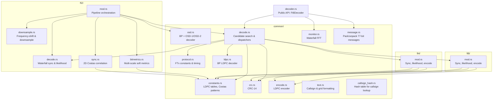

# trx-ftx

Pure Rust FT8/FT4/FT2 decoder and encoder library.

## Attribution

The FT8 and FT4 implementation is derived from
[kgoba/ft8_lib](https://github.com/kgoba/ft8_lib), a lightweight C
implementation of the FT8/FT4 protocols.

The FT2 implementation is based on the Fortran reference code in
[iu8lmc/Decodium-3.0-Codename-Raptor](https://github.com/iu8lmc/Decodium-3.0-Codename-Raptor).
FT2 is an experimental protocol that doubles FT4's symbol rate
(NSPS=288, 41.67 baud) while reusing the same LDPC(174,91) code and
4-GFSK modulation with four 4x4 Costas sync arrays.

## Architecture

```
trx-ftx/src/
├── lib.rs              # Module declarations
├── decoder.rs          # Public API: Ft8Decoder, Ft8DecodeResult
├── common/
│   ├── protocol.rs     # FTx constants, timing, FtxProtocol enum
│   ├── constants.rs    # LDPC tables, Costas patterns, Gray maps
│   ├── crc.rs          # CRC-14 compute/extract
│   ├── ldpc.rs         # Belief-propagation LDPC decoder
│   ├── osd.rs          # OSD-1/OSD-2 CRC-guided bit-flip decoder
│   ├── encode.rs       # LDPC(174,91) encoder
│   ├── decode.rs       # Candidate search, CRC verify, SNR, dispatchers
│   ├── monitor.rs      # Waterfall FFT spectrogram engine
│   ├── message.rs      # 77-bit message pack/unpack
│   ├── callsign_hash.rs # Callsign hash table for decode dedup
│   └── text.rs         # Callsign & grid character encoding
├── ft8/
│   └── mod.rs          # FT8 sync scoring, likelihood extraction, tone encoding
├── ft4/
│   └── mod.rs          # FT4 sync scoring, likelihood extraction, tone encoding
└── ft2/
    ├── mod.rs          # FT2 pipeline orchestration (peak search, decode loop)
    ├── decode.rs       # FT2 waterfall sync scoring & multi-scale likelihood
    ├── bitmetrics.rs   # Per-symbol FFT, 1/2/4-symbol coherent bit metrics
    ├── downsample.rs   # Frequency-domain shift & downsample via IFFT
    └── sync.rs         # 2D Costas reference waveforms & correlation
```



### Signal flow

**FT8/FT4:** Audio samples enter `common/monitor.rs` which accumulates
a waterfall spectrogram. `common/decode.rs` finds sync candidates by
dispatching to protocol-specific scoring in `ft8/` or `ft4/`, extracts
log-likelihood ratios from tone amplitudes, and runs the BP LDPC
decoder. Decoded 77-bit messages are unpacked by `common/message.rs`.

**FT2:** Audio enters `ft2/mod.rs` which drives a dedicated pipeline:
peak search in the averaged spectrum, frequency-shift downsampling
(`ft2/downsample.rs`), 2D sync scoring against precomputed Costas
reference waveforms (`ft2/sync.rs`), multi-scale coherent bit metric
extraction at 1/2/4-symbol integration depths (`ft2/bitmetrics.rs`),
and multi-pass LDPC decoding via iterative belief-propagation with OSD
fallback (`common/osd.rs`). The shared `common/` modules (encode, crc,
constants, protocol) are reused across all three protocols.
