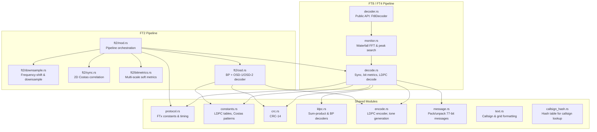

# trx-ftx

Pure Rust FT8/FT4/FT2 decoder and encoder library.

## Attribution

The FT8 and FT4 implementation is derived from
[kgoba/ft8_lib](https://github.com/kgoba/ft8_lib), a lightweight C
implementation of the FT8/FT4 protocols.

The FT2 implementation is based on the Fortran reference code in
[iu8lmc/Decodium-3.0-Codename-Raptor](https://github.com/iu8lmc/Decodium-3.0-Codename-Raptor).
FT2 is an experimental protocol that doubles FT4's symbol rate
(NSPS=288, 41.67 baud) while reusing the same LDPC(174,91) code and
4-GFSK modulation with four 4x4 Costas sync arrays.

## Architecture

### Signal flow

**FT8/FT4:** Audio samples enter `monitor.rs` which accumulates a
waterfall spectrogram. `decode.rs` finds sync candidates via Costas
correlation, extracts log-likelihood ratios from tone amplitudes, and
runs the LDPC decoder. Decoded 77-bit messages are unpacked by
`message.rs`.

**FT2:** Audio enters `ft2/mod.rs` which drives a dedicated pipeline:
peak search in the averaged spectrum, frequency-shift downsampling
(`downsample.rs`), 2D sync scoring against precomputed Costas
reference waveforms (`sync.rs`), multi-scale coherent bit metric
extraction at 1/2/4-symbol integration depths (`bitmetrics.rs`), and
multi-pass LDPC decoding via iterative belief-propagation with OSD
fallback (`osd.rs`). The shared `encode.rs`, `crc.rs`, and
`constants.rs` modules are reused across all three protocols.
