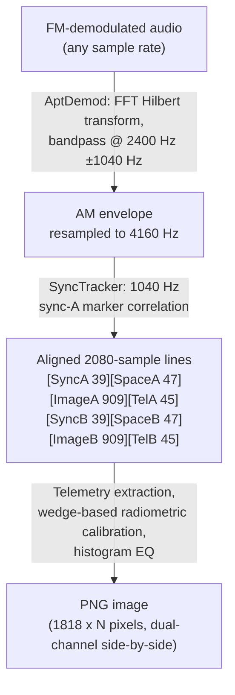
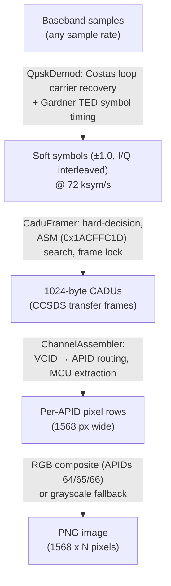

# trx-wxsat

Weather satellite image decoders for NOAA APT and Meteor-M LRPT signals.

## Supported Satellites

| Satellite      | Format | Frequency     | Modulation             |
|----------------|--------|---------------|------------------------|
| NOAA-15        | APT    | 137.620 MHz   | FM/AM subcarrier       |
| NOAA-18        | APT    | 137.9125 MHz  | FM/AM subcarrier       |
| NOAA-19        | APT    | 137.100 MHz   | FM/AM subcarrier       |
| Meteor-M N2-3  | LRPT   | 137.900 MHz   | QPSK, 72 kbps, CCSDS  |
| Meteor-M N2-4  | LRPT   | 137.100 MHz   | QPSK, 72 kbps, CCSDS  |

## Architecture

```
trx-wxsat/src/
├── lib.rs              # Module declarations, shared helpers
├── image_enc.rs        # Shared PNG encoding (grayscale + RGB)
├── noaa/
│   ├── mod.rs          # AptDecoder, AptImage (public API)
│   ├── apt.rs          # AM demodulator (Hilbert/FFT), line sync tracker
│   ├── image_enc.rs    # APT-specific dual-channel image assembly
│   └── telemetry.rs    # Wedge-based calibration, satellite ID, histogram EQ
└── lrpt/
    ├── mod.rs          # LrptDecoder, LrptImage (public API)
    ├── demod.rs        # QPSK demodulator (Costas loop + Gardner TED)
    ├── cadu.rs         # CCSDS CADU frame synchronisation (ASM search)
    └── mcu.rs          # Per-APID channel assembly, RGB composite
```

## Signal Flow

### NOAA APT



**Key DSP details:**

- AM envelope extraction uses an FFT-based Hilbert transform (rustfft) with
  bandpass filtering around the 2400 Hz subcarrier
- Sync detection uses cosine correlation against a 7-cycle 1040 Hz reference
  pattern, normalised by RMS; threshold 0.15 for acquisition, 0.075 for tracking
- Telemetry frames span 128 lines; wedges 1-8 provide known reference levels
  for piecewise-linear radiometric calibration; wedge 9 encodes the sensor
  channel ID
- Satellite identification is heuristic, based on the detected channel pairing
  (e.g. VIS + TIR4 maps to NOAA-18)
- Per-line normalisation clips to the 2nd-98th percentile before scaling

### Meteor-M LRPT



**LRPT channel mapping:**

| APID | Channel | Band              |
|------|---------|-------------------|
| 64   | 1       | Visible (0.5-0.7 µm)       |
| 65   | 2       | Visible/NIR (0.7-1.1 µm)   |
| 66   | 3       | Near-IR (1.6-1.8 µm)       |
| 67   | 4       | Mid-IR (3.5-4.1 µm)        |
| 68   | 5       | Thermal IR (10.5-11.5 µm)  |
| 69   | 6       | Thermal IR (11.5-12.5 µm)  |

**Key DSP details:**

- Costas loop parameters: bandwidth ~0.01 of symbol rate, damping factor 0.707
- Gardner TED operates on interpolated mid-sample points for timing error
  estimation
- Frame synchronisation searches for the 4-byte Attached Sync Marker
  (`0x1ACFFC1D`) and maintains lock/unlock state tracking
- Spacecraft ID extraction from VCDU header: ID 57 = Meteor-M N2-3,
  ID 58 = Meteor-M N2-4
- RGB compositing uses channels 1/2/3 when available; falls back to the
  highest-populated single channel as grayscale

## Public API

Both decoders share the same streaming interface:

```rust
// NOAA APT
let mut apt = AptDecoder::new(sample_rate);
apt.process_samples(&audio_batch);   // returns new line count
apt.line_count();                     // total lines so far
let image: Option<AptImage> = apt.finalize();  // PNG + telemetry
apt.reset();                          // prepare for next pass

// Meteor-M LRPT
let mut lrpt = LrptDecoder::new(sample_rate);
lrpt.process_samples(&baseband_batch);  // returns new MCU row count
lrpt.mcu_count();                       // total MCU rows so far
let image: Option<LrptImage> = lrpt.finalize();  // PNG + metadata
lrpt.reset();                           // prepare for next pass
```

### Output types

**`AptImage`**: PNG bytes, line count, first-line timestamp, identified
satellite (`NOAA-15`/`18`/`19`), sensor channels A and B
(`Visible1`, `NearIr2`, `ThermalIr4`, etc.)

**`LrptImage`**: PNG bytes, MCU row count, identified satellite
(`Meteor-M N2-3`/`N2-4`), comma-separated active APID list

## Dependencies

| Crate         | Purpose                          |
|---------------|----------------------------------|
| `trx-core`    | Shared core types                |
| `rustfft`     | FFT for Hilbert AM demodulation  |
| `num-complex` | Complex arithmetic               |
| `image`       | PNG encoding (png feature only)  |

## Integration

The crate plugs into `trx-server` as a decoder task. The server feeds PCM
audio from the SDR backend into `process_samples()`, auto-finalises on
timeout (no new lines/MCUs for a configurable period), and publishes
decoded images as `DecodedMessage::WxsatImage` / `DecodedMessage::LrptImage`
for client consumption. Images are saved to `~/.cache/trx-rs/wxsat/` and
`~/.cache/trx-rs/lrpt/`.
